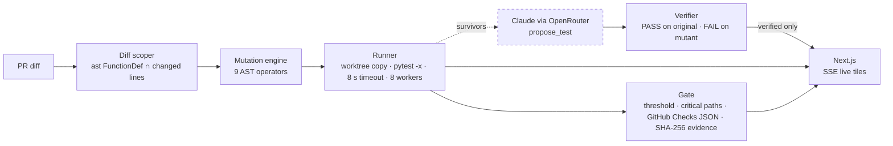

# KillScore

**100% coverage. 63% mutation score.** The SaaS release gate that scores whether your AI-written tests can actually catch a bug.

Live: https://killscore.hajin.xyz · API: https://killscore-api.hajin.xyz/healthz

> We flipped `>` to `>=` in the payment logic and all 40 tests still passed.

## Why this is different

Most teams measure test quality with coverage. They let a coding agent write the tests, watch the number hit 100%, and merge. A suite can execute every line of your code and still miss most of the bugs in it, because a test derived from the implementation cannot disagree with the implementation.

KillScore does diff-scoped mutation testing. It mutates only the functions your pull request touched, re-runs your own suite against every mutant in an isolated subprocess, and reports the percentage your tests actually killed. Then Claude proposes a test for each survivor, and a proposed test is shown to you only after our runner proves it passes on the original and fails on the mutant.

## Architecture



Six components. Exactly one is a model call, and its output never reaches the score.

## What the model is allowed to do

The model never computes the score. The model never marks a mutant killed. The model never edits the code under test. A proposed test is shown only after our runner proves it passes on the original and fails on the mutant. A proposal that cites a mutant id not in the current run is rejected before execution.

Verdicts: `killed` (suite exit 1), `survived` (exit 0), `timeout` (over 8 s, kept in the denominator, never counted as a kill), `error` (excluded from the denominator).

## Evaluation

20 copies of a billing module, one planted bug each, each with an AI-written suite at 100% line coverage. See [`evals/`](evals/) and the live table at https://killscore.hajin.xyz/evals. Regenerate with `make eval`.

## Quickstart

```
cp .env.example .env
docker compose up -d --build
open http://localhost:18093
```

Three demo repositories are seeded and run on first start. `OPENROUTER_API_KEY` is only needed for the "Propose a test" button.

Run the engine without the web stack:

```
cd apps/api && uv sync && uv run python -m killscore.run ../../demo/billing-api
```

## Layout

```
apps/api/killscore   FastAPI · engine.py · scoper.py · runner.py · proposals.py · gate.py · report.py
apps/web             Next.js 16 · /  /runs/[id]  /runs/[id]/mutants/[k]  /gate  /evals  /pricing
demo/                billing-api · auth-tokens · oss-small (inflection 0.5.1, MIT)
evals/               fixtures · bugs.yaml · gen.py · run.py
docs/                FINAL_DECISION.md (why this product) · archive/
```

## API

```
GET  /healthz
GET  /v1/repos
POST /v1/runs                         {repo_preset | inline_source + inline_tests, diff_only}
GET  /v1/runs/{id}                    summary + scoped targets
GET  /v1/runs/{id}/events             SSE (?replay=true replays a finished run)
GET  /v1/runs/{id}/mutants?status=    list
GET  /v1/mutants/{id}                 original/mutant source · executions · proposals
POST /v1/mutants/{id}/propose-test    Claude draft → runner verifies → verdict
GET  /v1/gate/{repo}/check            GitHub Checks payload
GET  /v1/runs/{id}/report.pdf         evidence PDF with SHA-256
GET  /v1/usage/{run_id}               tokens · cost · latency per LLM call
GET  /v1/evals                        eval results
```

## Built with

python · fastapi · sqlalchemy · postgresql · pytest · coverage.py · ast · weasyprint · sse · nextjs · react · typescript · tailwind · claude (via openrouter) · docker

Apache-2.0. Written during the 2026 AI Builders Hackathon; see [HACKATHON.md](HACKATHON.md).
