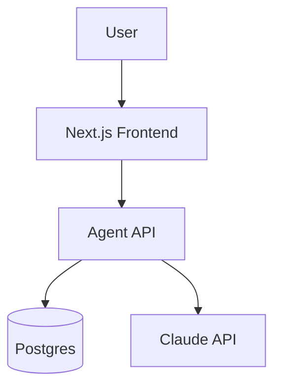

# 06. 24시간 완주용 래피드 빌드 툴킷

- 작성 기준일: **2026-09-15**
- 대상: AI Builders Hackathon 2026 (Devpost) / 제출 마감 **2026-09-15 11:00pm EDT = 2026-09-16 12:00 KST** (심사 09-16~09-20)
- 스택 전제: Next.js(App Router) 또는 FastAPI + PostgreSQL + Claude API(보조로 Gemini)
- 심사 배점(Devpost 확인): Technical Implementation 25% · Problem Solving & Impact 25% · Innovation & Creativity 20% · User Experience & Design 15% · Presentation & Demo 15%
- ⚠️ **필수 제출물 5종**: 제출 폼 / 동작하는 프로토타입 / 공개 GitHub 저장소 / **데모 영상(최대 5분)** / **발표 덱(최대 10슬라이드)**
- ⚠️ **참가 자격: 학생 전용(students only)** — 시작 전에 반드시 확인

> 이 문서의 모든 수치·모델 ID·CLI 명령·URL은 공식 문서에서 확인한 값이다. 출처는 각 절 하단에 링크로 남겼다.

---

## 0. 한 줄 결론 (먼저 읽을 것)

**Next.js App Router + Vercel + Neon(또는 Supabase) + Clerk + AI SDK v7(`@ai-sdk/anthropic`) + Stripe test mode + shadcn/ui** 조합이 24시간 안에 "배포된 SaaS처럼 보이는 것"을 만드는 최단 경로다.
FastAPI는 이미 파이썬 파이프라인(문서 파싱·ML·스크레이핑)이 핵심일 때만 선택하고, 그 경우에도 프론트는 Vercel에 별도로 올린다.

---

## 1. 배포된 풀스택 AI 앱을 가장 빨리 만드는 경로

### 1-1. Vercel + Next.js (권장 1순위)

**무료 티어(Hobby) 한도 — 2026-08-31 문서 갱신 기준**

| 항목 | Hobby 포함량 |
| --- | --- |
| Fast Data Transfer | First 100 GB |
| Fast Origin Transfer | First 10 GB |
| Edge Requests | First 1,000,000 |
| Function Invocations | First 1,000,000 |
| Active CPU | 4 CPU-hrs |
| Provisioned Memory | 360 GB-hrs |
| Image Transformations | First 5,000 |
| 프로젝트 수 | 200 |
| 함수 최대 실행시간 | 300s (5 minutes) |
| 빌드 vCPU / 메모리 | 2 vCPU / 8 GB |
| 하루 배포 횟수 | 100 |
| Runtime Logs 보존 | 1 hour of logs |

**핵심 주의점(gotcha)**

- Hobby 플랜은 **비상업적·개인 용도로 제한**된다(`fair use guidelines`의 commercial usage 조항). 해커톤 데모는 문제없지만, 데모에서 실제 결제를 받으면 안 된다 → **Stripe는 반드시 test mode**로.
- Active CPU 4 CPU-hrs가 실질적 병목이다. LLM 스트리밍은 대기 시간이 길어도 Active CPU는 적게 먹지만, 동기 폴링 루프를 돌리면 순식간에 소진된다.
- 함수 300초 제한 → 긴 에이전트 루프는 반드시 **스트리밍**으로 쪼개거나 백그라운드 잡으로 뺀다.
- 무료 티어에서 로그가 **1시간만** 남는다. 심사 중 디버깅을 위해 Sentry 또는 Langfuse를 반드시 붙일 것(6절).

**셋업 (약 10분)**

```bash
npx create-next-app@latest my-saas --typescript --tailwind --app --eslint
cd my-saas
npm i -g vercel
vercel login
vercel link
vercel env add ANTHROPIC_API_KEY production
vercel env add DATABASE_URL production
vercel --prod
```

GitHub 연동으로 push-to-deploy를 켜두면 이후 `git push`만으로 배포된다(데모 영상에서 "CI/CD 붙어 있음"을 보여주기 좋다).

출처: https://vercel.com/docs/plans/hobby

### 1-2. FastAPI 배포: Railway / Render / Fly

| 플랫폼 | 무료·최저가 조건 | 셋업 시간 | 결정적 gotcha |
| --- | --- | --- | --- |
| **Railway** | Free Trial: **$5 one-time credit (30 days)**, 카드 불필요, 서비스당 2 vCPU / 1 GB, replica 2, 로그 7일. Hobby는 $5/월 + $5/월 사용 크레딧 포함(이월 없음), 서비스당 최대 48 vCPU / 48 GB, 프로젝트 50개, 볼륨 5 GB | **5~10분** | 트라이얼 크레딧이 30일 만료. Postgres 애드온이 크레딧을 같이 먹는다 |
| **Render** | 무료 웹서비스: **750 Free instance hours**/워크스페이스/월, **15분 무트래픽 시 spin down**(콜드스타트 수십 초), 디스크 없음(ephemeral). 무료 Postgres: **1 GB**, **생성 후 30일에 만료**(+14일 유예 후 삭제), 백업·커넥션 풀링 없음 | **5~10분** | **심사 시점에 앱이 자고 있을 수 있다.** 데모 직전 반드시 깨우고, 5분 간격 헬스체크 핑을 걸어둘 것. 무료 Postgres는 프로덕션 DB로 쓰지 말 것 |
| **Fly.io** | 문서상 명시적 무료 티어 없음. `shared-cpu-1x` 256MB ≈ **$0.0028/hour (~$2.02/month)**, 북미·유럽 egress **$0.02 per GB**, Managed Postgres는 플랜·스토리지별 과금 | **15~25분** | Dockerfile/`fly.toml` 튜닝이 필요해 24시간 레이스에서는 가장 느리다. 지연시간이 정말 중요할 때만 |

**권장:** 해커톤에서는 **Railway**. `railway up` 한 번이면 끝이고 Postgres도 한 클릭이다.

```bash
npm i -g @railway/cli
railway login
railway init
railway add --database postgres
railway variables --set "ANTHROPIC_API_KEY=sk-ant-..."
railway up
railway domain      # 공개 URL 발급
```

Render를 쓴다면 저장소 루트에 `render.yaml`을 두고 Blueprint로 한 번에 올린다.

```yaml
services:
  - type: web
    name: api
    runtime: python
    buildCommand: "pip install -r requirements.txt"
    startCommand: "uvicorn app.main:app --host 0.0.0.0 --port $PORT"
    healthCheckPath: /healthz
```

출처: https://railway.com/pricing · https://render.com/docs/free · https://fly.io/docs/about/pricing/

### 1-3. Postgres: Neon vs Supabase

| | **Neon** Free | **Supabase** Free |
| --- | --- | --- |
| 스토리지 | 0.5 GB/project | 500 MB database size (Shared CPU · 500 MB RAM) |
| 컴퓨트 | 100 CU-hours/project (월) | — |
| 프로젝트 수 | 100 | 2 active projects |
| 브랜치 | 10/project | (DB branching 없음) |
| Autosuspend | After 5 min (Free에서 해제 불가) | Free 프로젝트는 **1주 미사용 시 일시정지** |
| Egress | — | 5 GB egress (+ 5 GB cached egress) |
| 파일 스토리지 | — | 1 GB file storage |
| MAU | — | 50,000 monthly active users |
| Edge Functions | — | 500,000 invocations |
| 백업/PITR | — | 없음 |

**선택 기준**

- **Neon**: "DB만 필요하고 Drizzle/Prisma로 직접 쓴다" → 서버리스 드라이버가 Vercel Edge와 궁합이 좋다. **브랜치 10개**는 데모용 시드 데이터/롤백에 강력하다.
- **Supabase**: "Auth + Storage + Realtime까지 한 번에" → 인증·파일 업로드·실시간 기능이 데모 시나리오에 있으면 압도적으로 빠르다.
- **공통 gotcha**: 둘 다 **오토서스펜드/일시정지**가 있다. 심사 전 반드시 깨우고, 첫 쿼리 콜드스타트(수백 ms~수 초)를 UI에서 스켈레톤으로 가려라.
- Neon 0.5 GB / Supabase 500 MB는 로그 테이블을 무심코 쌓으면 금방 찬다. **LLM 요청 전문 로깅은 Langfuse로 빼고 DB에는 요약만** 넣는다.

```bash
# Neon
npx neonctl auth
npx neonctl projects create --name hackathon
npx neonctl connection-string main   # DATABASE_URL

# Supabase
npm i -g supabase
supabase login
supabase init
supabase link --project-ref <ref>
supabase db push
```

출처: https://neon.com/docs/introduction/plans · https://supabase.com/pricing

### 1-4. 인증: Clerk vs Auth.js vs Supabase Auth

| | **Clerk** | **Auth.js (NextAuth)** | **Supabase Auth** |
| --- | --- | --- | --- |
| 무료 한도 | **50,000 MRU까지 무료** (2026-02-05부터 기존 10,000 → 50,000으로 상향). Pro $25/mo, Business $300/mo | 무제한(셀프호스팅, 라이브러리) | 50,000 MAU |
| 셋업 시간 | **10~15분** | 30~50분 | 15~20분 |
| UI 제공 | `<SignIn/>`, `<UserButton/>`, Organizations, 소셜 로그인 다 포함 → **화면이 바로 프로다워짐** | UI 직접 작성 | UI 직접 작성(또는 Auth UI) |
| gotcha | MRU는 MAU보다 좁은 과금 단위. 개발용 인스턴스와 프로덕션 인스턴스 키가 다르다 | DB 어댑터 + provider 설정에 시간이 든다. 세션 전략(JWT vs DB) 결정 필요 | RLS 정책을 안 짜면 데이터가 새어나간다 |

**24시간 레이스 권장: Clerk.** `<UserButton/>` 하나로 대시보드 헤더가 완성되고, 심사위원이 보는 "완성도"가 즉시 올라간다.

```bash
npm install @clerk/nextjs
# .env.local
# NEXT_PUBLIC_CLERK_PUBLISHABLE_KEY=pk_test_...
# CLERK_SECRET_KEY=sk_test_...
```

`middleware.ts`로 보호 라우트를 잡고, `app/layout.tsx`를 `<ClerkProvider>`로 감싼다.

출처: https://clerk.com/pricing

### 1-5. Stripe test mode 가격 페이지 (심사 임팩트 대비 가성비 최고)

Pricing 페이지 + 동작하는 Checkout은 "제품처럼 보인다"는 인상을 가장 싸게 만든다. **test mode로만** 구성한다.

```bash
npm install --save stripe @stripe/stripe-js next
npm install -g @stripe/cli
stripe login
stripe listen --forward-to localhost:3000/api/webhooks
STRIPE_WEBHOOK_SECRET=$(stripe listen --print-secret) npm run dev
```

`.env`:

```
# https://dashboard.stripe.com/apikeys
NEXT_PUBLIC_STRIPE_PUBLISHABLE_KEY=<<YOUR_PUBLISHABLE_KEY>>
STRIPE_SECRET_KEY=<<YOUR_SECRET_KEY>>
# Set this environment variable to support webhooks — https://stripe.com/docs/webhooks#verify-events
# STRIPE_WEBHOOK_SECRET=whsec_12345
```

`lib/stripe.ts`:

```ts
import 'server-only'

import Stripe from 'stripe'

export const stripe = new Stripe(process.env.STRIPE_SECRET_KEY)
```

`app/api/checkout_sessions/route.ts` (Route Handler):

```ts
    // Create Checkout Sessions from body params.
    const session = await stripe.checkout.sessions.create({
      line_items: [
        {
          // Provide the exact Price ID (for example, price_1234) of the product you want to sell
          price: '{{PRICE_ID}}',
          quantity: 1,
        },
      ],
      mode: 'subscription',
      success_url: `${origin}/success?session_id={CHECKOUT_SESSION_ID}`,
    });
    return NextResponse.redirect(session.url, 303)
```

**테스트 카드**

| Scenario | Card Number |
| --- | --- |
| Payment succeeds | 4242424242424242 |
| Payment requires 3DS authentication | 4000002500003155 |
| Payment is declined | 4000000000009995 |

**gotcha**: `mode: 'subscription'`을 쓰려면 Stripe 대시보드에서 **recurring Price**를 먼저 만들어야 한다. 데모에서는 월 $19 / $49 두 개면 충분하다. 성공 페이지는 반드시 만들어라 — 여기서 끊기면 "미완성"으로 보인다.

출처: https://docs.stripe.com/checkout/quickstart

### 1-6. 이메일: Resend

| 항목 | Free |
| --- | --- |
| 일일 한도 | 100 emails a day |
| 월 한도 | 3,000 emails/월 |
| 도메인 | 3 domains |
| 데이터 보존 | 30-day data retention |
| 자동화 실행 | 10,000 automation runs/월 |

**gotcha**: 실질 병목은 **하루 100통**이다. 자체 도메인 검증(DNS) 없이는 `onboarding@resend.dev`에서만 보낼 수 있고 수신자도 제한된다. 24시간 안에 DNS 전파를 기다릴 여유가 없다면 **이메일 기능은 "가입 환영 메일" 하나로 축소**하거나 UI만 만들고 실제 발송은 데모에서 생략하는 편이 낫다.

```bash
npm install resend
```

```ts
import { Resend } from 'resend';
const resend = new Resend(process.env.RESEND_API_KEY);
await resend.emails.send({
  from: 'onboarding@resend.dev',
  to: 'you@example.com',
  subject: 'Welcome',
  html: '<strong>Welcome aboard</strong>',
});
```

출처: https://resend.com/pricing

---

## 2. Claude API 현재 상태 (2026-09 기준, 공식 문서 검증)

### 2-1. 현행 모델과 가격

| Model | Claude API ID | Context | Max output | Input $/MTok | Output $/MTok | Cache read |
| --- | --- | --- | --- | --- | --- | --- |
| Claude Fable 5.1 | `claude-fable-5-1` | 1M | 128K | $10 | $50 | $0.25 |
| Claude Opus 5 | `claude-opus-5` | 1M | 128K | $5 | $25 | $0.50 |
| Claude Sonnet 5 | `claude-sonnet-5` | 1M | 128K | $2 | $10 | $0.20 |
| Claude Haiku 4.5 | `claude-haiku-4-5` (pinned: `claude-haiku-4-5-20251001`) | 200K | 64K | $1 | $5 | $0.10 |

- Legacy(여전히 사용 가능): `claude-fable-5`, `claude-opus-4-8`, `claude-opus-4-7`, `claude-opus-4-6`, `claude-opus-4-5`, `claude-sonnet-4-6`, `claude-sonnet-4-5`
- **Batch API는 입·출력 모두 50% 할인** (예: Opus 5 = $2.50 / $12.50, Sonnet 5 = $1 / $5, Haiku 4.5 = $0.50 / $2.50)
- Prompt caching 배수: 5분 캐시 쓰기 **1.25x**, 1시간 캐시 쓰기 **2x**, 캐시 히트 **0.1x** (Fable 5.1 / Mythos 5.1만 0.025x)
- Web search: **$10 per 1,000 searches**. Web fetch: **추가 비용 없음**(토큰만)
- Code execution: 조직당 **1,550 free hours/월**, 초과분 $0.05/hour/container. 단 `web_search_20260209` 또는 `web_fetch_20260209`와 함께 쓰면 **무료**
- Sonnet 5의 $2/$10은 도입가였으나 **정식 가격으로 확정**(2026-09-01 인상 예정이 취소됨)
- Claude 4.7 이후 모델은 새 토크나이저를 쓰며 **같은 텍스트에 약 30% 더 많은 토큰**이 나온다 → 예산 계산 시 반드시 반영

**해커톤 모델 전략**

- 주 경로: `claude-opus-5` (추론 품질이 데모 설득력을 만든다)
- 대량·저지연 경로(분류, 태깅, 요약 등 배치성): `claude-haiku-4-5` 또는 `claude-sonnet-5`
- 비용 통제: `output_config: {effort: "low"}` + prompt caching. 시스템 프롬프트를 캐시 브레이크포인트로 고정하면 반복 데모에서 비용이 1/10 수준으로 떨어진다

출처: https://platform.claude.com/docs/en/about-claude/pricing · https://platform.claude.com/docs/en/models/overview

### 2-2. 반드시 알아야 할 API 변경점 (구버전 코드 복붙 시 400 에러)

| 영역 | 낡은 코드 | 현재 |
| --- | --- | --- |
| Extended thinking | `thinking: {type: "enabled", budget_tokens: N}` | `thinking: {type: "adaptive"}`. `budget_tokens`는 Fable 5/5.1, Opus 5/4.8/4.7, Sonnet 5에서 **400** |
| 노력 조절 | — | `output_config: {effort: "low"|"medium"|"high"|"xhigh"|"max"}` (기본 `high`) |
| 구조화 출력 | `output_format` | `output_config: {format: {...}}` 또는 `client.messages.parse()` |
| Assistant prefill | 마지막 assistant 턴 프리필 | Fable 5/5.1, Opus 5, Sonnet 5, 4.6~4.8 계열에서 **400**. 구조화 출력이나 시스템 프롬프트로 대체 |
| 샘플링 파라미터 | `temperature`/`top_p`/`top_k` | Opus 5 / Sonnet 5 / Fable 5 계열에서 **제거됨(400)** |
| Web search 툴 타입 | `web_search_20250305` | `web_search_20260209` (Opus 5/4.6~4.8, Sonnet 5/4.6) |
| Web fetch 툴 타입 | `web_fetch_20250910` | `web_fetch_20260209` |
| Code execution | — | `code_execution_20260521` → 결과 블록 타입은 `bash_code_execution_tool_result` |
| Files / Skills API | `client.beta.files.*` / `client.beta.skills.*` + beta 헤더 | 정식 출시: `client.files.*` / `client.skills.*`, 베타 헤더 불필요 |
| thinking 표시 | 기본 `summarized` | Opus 5 / Sonnet 5 / Fable 5 계열은 기본 **`omitted`**. 사용자에게 추론을 보여주려면 `thinking: {type: "adaptive", display: "summarized"}` 명시 |

> **모델 ID에 날짜 접미사를 붙이지 말 것.** `claude-opus-5`가 그 자체로 pinned snapshot이다. `claude-opus-5-20260401` 같은 문자열은 존재하지 않는다.

### 2-3. 기능별 현재 상태 요약

| 기능 | 상태 | 요점 |
| --- | --- | --- |
| **Tool use** | GA | `strict: true`를 툴 정의 **최상위**에 두면 `input` 스키마 검증 보장(`additionalProperties: false` + `required` 필수). 병렬 툴 호출이 기본 ON — 모든 `tool_result`를 **하나의 user 메시지**에 담아 반환해야 함 |
| **Streaming** | GA | `client.messages.stream()` / `.stream()`. `max_tokens`가 클 때(≥64K)는 스트리밍 필수 |
| **Structured outputs** | GA | `output_config.format` 또는 `messages.parse()`. Opus 5 / Sonnet 5 / Haiku 4.5 등 지원. 재귀 스키마·numeric 제약(`minimum`/`maximum`)·문자열 길이 제약 미지원 |
| **Prompt caching** | GA | prefix 매칭. 렌더 순서 `tools` → `system` → `messages`. 최대 4 breakpoint. `usage.cache_read_input_tokens`로 검증 |
| **Batch API** | GA | 50% 할인. 결과는 **순서 보장 없음** → `custom_id`로 매칭 |
| **Computer use / Browser use** | GA(툴셋 신형) | `computer_toolset_20260801`(정의 오버헤드 ≈ 4,500 input tokens), `browser_toolset_20260801`(≈ 6,600 tokens). 해커톤 24시간에는 **권장하지 않음** — 셋업·안정성 리스크가 크다 |
| **Agent SDK** | 별도 제품 | `claude-agent-sdk`(Python) / `@anthropic-ai/claude-agent-sdk`(TS). Claude Code 하네스를 라이브러리로. 내장 Read/Write/Edit/Bash/Glob/Grep/WebSearch/WebFetch + MCP + subagents + hooks + sessions. **호스팅은 직접** |
| **Managed Agents** | Beta | 서버가 에이전트 루프와 샌드박스를 모두 호스팅. Agent 생성(1회) → Session 생성(매 실행). 세션 런타임 **$0.08 per session-hour** + 토큰 |
| **MCP connector** | Beta | `mcp_servers=[{type:"url", url, name}]` **와 함께** `tools=[{type:"mcp_toolset", mcp_server_name:<같은 name>}]`를 반드시 같이 보내야 함(둘 중 하나만 보내면 validation error). beta 헤더 `mcp-client-2025-11-20` |

출처: https://platform.claude.com/docs/en/build-with-claude/structured-outputs · https://code.claude.com/docs/en/agent-sdk/overview

### 2-4. 최소 패턴 A — Next.js (AI SDK v7) 스트리밍 챗 + 툴 콜링

AI SDK 현재 메이저 버전은 **v7**이다.

```bash
pnpm add ai @ai-sdk/react @ai-sdk/anthropic zod
```

`.env.local`:

```
ANTHROPIC_API_KEY=sk-ant-...
```

`app/api/chat/route.ts`:

```typescript
import {
  streamText,
  UIMessage,
  convertToModelMessages,
  tool,
  isStepCount,
  createUIMessageStreamResponse,
  toUIMessageStream,
} from 'ai';
import { anthropic } from '@ai-sdk/anthropic';
import { z } from 'zod';

export const maxDuration = 300;

export async function POST(req: Request) {
  const { messages }: { messages: UIMessage[] } = await req.json();

  const result = streamText({
    model: anthropic('claude-opus-5'),
    messages: await convertToModelMessages(messages),
    stopWhen: isStepCount(5),
    tools: {
      weather: tool({
        description: 'Get the weather in a location (fahrenheit)',
        inputSchema: z.object({
          location: z.string().describe('The location to get the weather for'),
        }),
        execute: async ({ location }) => {
          const temperature = Math.round(Math.random() * (90 - 32) + 32);
          return { location, temperature };
        },
      }),
      convertFahrenheitToCelsius: tool({
        description: 'Convert a temperature in fahrenheit to celsius',
        inputSchema: z.object({
          temperature: z.number().describe('The temperature in fahrenheit to convert'),
        }),
        execute: async ({ temperature }) => {
          const celsius = Math.round((temperature - 32) * (5 / 9));
          return { celsius };
        },
      }),
    },
  });

  return createUIMessageStreamResponse({
    stream: toUIMessageStream({ stream: result.stream }),
  });
}
```

`app/page.tsx`:

```typescript
'use client';

import { useChat } from '@ai-sdk/react';
import { useState } from 'react';

export default function Chat() {
  const [input, setInput] = useState('');
  const { messages, sendMessage } = useChat();

  return (
    <div className="flex flex-col w-full max-w-md py-24 mx-auto stretch">
      {messages.map(message => (
        <div key={message.id} className="whitespace-pre-wrap">
          {message.role === 'user' ? 'User: ' : 'AI: '}
          {message.parts.map((part, i) => {
            switch (part.type) {
              case 'text':
                return <div key={`${message.id}-${i}`}>{part.text}</div>;
              case 'tool-weather':
              case 'tool-convertFahrenheitToCelsius':
                return (
                  <pre key={`${message.id}-${i}`}>
                    {JSON.stringify(part, null, 2)}
                  </pre>
                );
            }
          })}
        </div>
      ))}

      <form onSubmit={e => {
        e.preventDefault();
        sendMessage({ text: input });
        setInput('');
      }}>
        <input
          className="fixed dark:bg-zinc-900 bottom-0 w-full max-w-md p-2 mb-8 border border-zinc-300 dark:border-zinc-800 rounded shadow-xl"
          value={input}
          placeholder="Say something..."
          onChange={e => setInput(e.currentTarget.value)}
        />
      </form>
    </div>
  );
}
```

**v7에서 바뀐 것 (구버전 튜토리얼 복붙 시 터짐)**

- `messages`는 `UIMessage[]`이고 렌더링은 `message.content`가 아니라 **`message.parts` 배열**을 순회한다.
- 툴 파트 타입은 `tool-<툴이름>` 형태다(`tool-weather`).
- `useChat`이 `input`/`handleInputChange`/`handleSubmit`을 더 이상 돌려주지 않는다 → **입력 state는 직접** `useState`로 관리하고 `sendMessage({ text })`로 보낸다.
- 툴 스키마 키는 `parameters`가 아니라 **`inputSchema`**다.
- 멀티스텝 루프는 `maxSteps`가 아니라 **`stopWhen: isStepCount(n)`**.
- 응답 반환은 `result.toDataStreamResponse()`가 아니라 **`createUIMessageStreamResponse({ stream: toUIMessageStream({ stream: result.stream }) })`**.
- Vercel 함수 300초 제한 대응으로 라우트에 `export const maxDuration = 300;`을 넣어라.

출처: https://ai-sdk.dev/docs/getting-started/nextjs-app-router · https://ai-sdk.dev/providers/ai-sdk-providers/anthropic

### 2-5. 최소 패턴 B — FastAPI (anthropic Python SDK) 스트리밍 + 툴 콜링

```bash
pip install "anthropic" fastapi "uvicorn[standard]" sqlalchemy psycopg[binary]
export ANTHROPIC_API_KEY=sk-ant-...
```

**스트리밍(SSE) 엔드포인트**

```python
import anthropic
from fastapi import FastAPI
from fastapi.responses import StreamingResponse
from pydantic import BaseModel

app = FastAPI()
client = anthropic.AsyncAnthropic()

class ChatIn(BaseModel):
    messages: list[dict]

@app.post("/api/chat")
async def chat(body: ChatIn):
    async def gen():
        async with client.messages.stream(
            model="claude-opus-5",
            max_tokens=64000,
            thinking={"type": "adaptive", "display": "summarized"},
            system="You are the assistant inside <product>. Be concise and cite the data you used.",
            messages=body.messages,
        ) as stream:
            async for text in stream.text_stream:
                yield f"data: {text}\n\n"
        yield "data: [DONE]\n\n"

    return StreamingResponse(gen(), media_type="text/event-stream")
```

**툴 콜링 — 툴 러너(권장, beta)**

```python
import anthropic
from anthropic import beta_tool

client = anthropic.Anthropic()

@beta_tool
def search_orders(customer_email: str, status: str = "all") -> str:
    """Search orders for a customer.

    Args:
        customer_email: The customer's email address.
        status: One of "all", "open", "shipped".
    """
    return "ORD-1029 shipped 2026-09-11; ORD-1044 open"

runner = client.beta.messages.tool_runner(
    model="claude-opus-5",
    max_tokens=16000,
    tools=[search_orders],
    messages=[{"role": "user", "content": "Where is jane@acme.com's latest order?"}],
)

for message in runner:
    print(message)
```

**구조화 출력(대시보드 카드/차트 데이터 생성에 유용)**

```python
from pydantic import BaseModel
from anthropic import Anthropic

class ContactInfo(BaseModel):
    name: str
    email: str
    plan_interest: str
    demo_requested: bool

client = Anthropic()

response = client.messages.parse(
    model="claude-opus-5",
    max_tokens=1024,
    messages=[{"role": "user", "content": "..."}],
    output_format=ContactInfo,
)

print(response.parsed_output)
```

**gotcha 모음**

- `max_tokens`를 너무 낮게 잡지 말 것. 비스트리밍은 `~16000`, 스트리밍은 `~64000`이 무난한 기본값이다.
- 툴 입력은 **반드시 `json.loads()`로 파싱**한다. 모델이 유니코드/슬래시 이스케이프를 다르게 낼 수 있어 문자열 매칭은 깨진다.
- 병렬 툴 호출 결과는 **한 user 메시지에 전부** 담는다. 나눠 보내면 모델이 병렬 호출을 그만한다.
- 실패한 툴도 `tool_result` + `is_error: true`로 **반드시 돌려준다**(누락 금지).
- 에러 핸들링은 넓은 `except APIStatusError` 하나로 잡지 말고 `NotFoundError` → `RateLimitError` → `APIStatusError` → `APIConnectionError` 순으로 구체적인 것부터 체인으로 잡는다.

### 2-6. Claude Agent SDK 최소 패턴 (에이전트형 데모를 만들 때)

Claude Code 하네스를 라이브러리로 쓴다. 파일 읽기/편집/Bash/검색이 내장이라 "코드를 스스로 고치는 에이전트" 류 데모를 몇십 분에 만든다. 전제: **Node.js 18+** 또는 **Python 3.10+**.

```bash
# TypeScript
npm init -y && npm pkg set type=module
npm install @anthropic-ai/claude-agent-sdk
npm install --save-dev tsx

# Python (uv)
uv init && uv add claude-agent-sdk
# Python (pip)
python3 -m venv .venv && source .venv/bin/activate && pip install claude-agent-sdk

export ANTHROPIC_API_KEY=your-api-key
```

```typescript
import { query } from "@anthropic-ai/claude-agent-sdk";

for await (const message of query({
  prompt: "Review utils.py for bugs that would cause crashes. Fix any issues you find.",
  options: {
    allowedTools: ["Read", "Edit", "Glob"],
    permissionMode: "acceptEdits"
  }
})) {
  if (message.type === "assistant" && message.message?.content) {
    for (const block of message.message.content) {
      if ("text" in block) console.log(block.text);
      else if ("name" in block) console.log(`Tool: ${block.name}`);
    }
  } else if (message.type === "result") {
    console.log(`Done: ${message.subtype}`);
  }
}
```

```python
import asyncio
from claude_agent_sdk import query, ClaudeAgentOptions, AssistantMessage, ResultMessage

async def main():
    async for message in query(
        prompt="Review utils.py for bugs that would cause crashes. Fix any issues you find.",
        options=ClaudeAgentOptions(
            allowed_tools=["Read", "Edit", "Glob"],
            permission_mode="acceptEdits",
        ),
    ):
        if isinstance(message, AssistantMessage):
            for block in message.content:
                if hasattr(block, "text"):
                    print(block.text)
                elif hasattr(block, "name"):
                    print(f"Tool: {block.name}")
        elif isinstance(message, ResultMessage):
            print(f"Done: {message.subtype}")

asyncio.run(main())
```

**gotcha**: SDK는 `.env`를 자동으로 읽지 않는다 — `dotenv`로 직접 로드하거나 셸 환경변수로 넣어야 한다. `npm ci --omit=optional`로 설치하면 번들 바이너리가 빠져 동작하지 않는다. 그리고 **claude.ai 로그인/레이트리밋을 제3자 제품에 제공하는 것은 사전 승인 없이는 허용되지 않는다** — 반드시 API 키 인증을 쓸 것.

출처: https://code.claude.com/docs/en/agent-sdk/quickstart · https://code.claude.com/docs/en/agent-sdk/overview

---

## 3. 스타터 템플릿 / 보일러플레이트 (프로다운 SaaS 외관을 몇 시간에)

> 모든 수치는 2026-09-15 GitHub API·공식 문서 기준.

### 3-0. 속도 순위 (프로다운 외관까지 걸리는 시간)

| # | 선택지 | 데모 구동까지 | 이유 |
| --- | --- | --- | --- |
| 1 | **Vercel `ai-chatbot`** | 약 10분(원클릭 배포) | 이미 AI 제품. Auth + Postgres + 대화 기록 + artifacts 내장. 랜딩 페이지는 약함 |
| 2 | **`nextjs/saas-starter`** | 약 20분 | 랜딩 + 가격 + 대시보드 + Stripe + Drizzle/Postgres + JWT 인증이 한 저장소에. 최고의 "SaaS 껍데기" |
| 3 | **`create-next-app -e with-supabase` + shadcn blocks** | 약 30분 | 통제권 최대, 서프라이즈 최소. Postgres+auth+pgvector가 한 대시보드에 |
| 4 | **v0.app / Lovable / Bolt** | 랜딩 5분 | 가장 빠른 "예쁜" 마케팅 페이지. GitHub로 내보내 #1/#2에 접붙인다 |
| 5 | **`full-stack-fastapi-template`** | 약 30분 | AI 로직이 반드시 파이썬일 때만 |

**우승 조합(권장):** `nextjs/saas-starter`(껍데기) + `vercel/ai-chatbot`의 chat route 이식 + v0/Lovable로 만든 hero 섹션 + shadcn `dashboard-01` 블록 + tweakcn 테마.

### 3-1. 개별 템플릿 상세

**① Vercel AI Chatbot**
- https://github.com/vercel/ai-chatbot · 템플릿: https://vercel.com/templates/next.js/nextjs-ai-chatbot
- ★ 약 20.9k · 최종 push **2026-07-08** · 라이선스 **"Other"**(SPDX 없음 — 상업 이용 전 `LICENSE` 확인 필요)
- 포함: Next.js App Router + RSC, AI SDK(AI Gateway 경유 Anthropic/OpenAI/Google/xAI 등), **Auth.js**, **Neon Serverless Postgres**(Drizzle) 대화 기록, Vercel Blob 파일 저장, shadcn/ui + Tailwind + Radix, artifacts/canvas UI, 모델 스위처
- 랜딩 페이지 없음 / 빌링 없음
```bash
npx create-next-app@latest my-app --example "https://github.com/vercel/ai-chatbot"
npm i -g vercel && vercel link && vercel env pull
pnpm install && pnpm db:migrate && pnpm dev
```
- gotcha: pnpm 사실상 필수, Vercel env pull 전제(다른 곳 배포 시 `AI_GATEWAY_API_KEY` 수동 설정), 실제 Postgres URL 없으면 부팅 실패

**② Next.js SaaS Starter (`nextjs/saas-starter`, leerob/Vercel)**
- https://github.com/nextjs/saas-starter · 데모 https://next-saas-start.vercel.app
- ★ 약 16.1k · 최종 push **2025-12-11 (약 9개월 정체)** · **MIT**
- 포함: 마케팅 **랜딩 페이지**, **Stripe Checkout 연결된 가격 페이지**, CRUD 대시보드, Stripe Customer Portal, httpOnly 쿠키 **JWT 인증**(자체 구현), 미들웨어 라우트 보호, **RBAC(Owner/Member)**, 팀/활동 로그, **Postgres + Drizzle**, shadcn/ui + Tailwind v4
```bash
git clone https://github.com/nextjs/saas-starter && cd saas-starter
pnpm install && pnpm db:setup && pnpm db:migrate && pnpm db:seed && pnpm dev
# seeded login: test@test.com / admin123 ; test card 4242 4242 4242 4242
stripe listen --forward-to localhost:3000/api/stripe/webhook
```
- gotcha: 의존성이 9개월 낡음 → 시작 전에 `pnpm up --latest` 한 번 돌릴 것(React 19 / Next 16 peer 경고가 데모 중에 터지는 것보다 낫다)

**③ Next.js + Supabase Starter**
- https://vercel.com/templates/next.js/supabase (`vercel/next.js/examples/with-supabase`) · MIT · 상시 갱신
- 포함: App Router / Server Components / 미들웨어를 관통하는 쿠키 기반 **Supabase Auth**, Supabase Postgres, Tailwind, TS, shadcn/ui 스타일 컴포넌트. Stripe·랜딩 없음
- **pgvector가 같은 대시보드에 있어 RAG형 AI SaaS의 최적 베이스**
```bash
npx create-next-app@latest my-app -e with-supabase
```

**④ Stripe + Supabase SaaS Starter Kit**
- https://vercel.com/templates/next.js/stripe-supabase-saas-starter-kit · https://github.com/dzlau/stripe-supabase-saas-template
- 포함: 가입/로그인/로그아웃/비밀번호 재설정 전체 플로우, Google + GitHub OAuth, Stripe Checkout + Pricing Table + 웹훅, Postgres + Drizzle, 보호된 대시보드, Tailwind + shadcn/ui
- ③의 빌링 공백을 정확히 메운다. 단 커뮤니티 유지보수(Vercel 공식 아님)
```bash
npx create-next-app@latest my-app --example "https://github.com/dzlau/stripe-supabase-saas-template"
```

**⑤ next-forge (`vercel/next-forge`)** — ★ 약 7.7k · push 2026-05-28 · MIT · https://next-forge.com
- Turborepo 모노레포: web(랜딩, :3001) / app(대시보드, :3000) / api(:3002) / email(:3003) / docs(:3004), Clerk, Stripe, Prisma + Neon, BaseHub CMS, Sentry, shadcn/ui, Resend
- `npx next-forge@latest init`
- **24시간에는 비권장.** 가장 프로덕션급이지만 서드파티 계정 6개를 준비해야 한다

**⑥ SaaS Boilerplate (`ixartz/SaaS-Boilerplate`)** — ★ 약 7.4k · push **2026-09-02(활발)** · MIT
- 랜딩 + 대시보드 + **Clerk**(MFA/패스워드리스/소셜) + **멀티테넌시 & 팀 스위처** + RBAC + Stripe + Drizzle/Postgres + i18n(next-intl) + Sentry + Pino + Vitest/Playwright + shadcn/ui
```bash
git clone --depth=1 https://github.com/ixartz/SaaS-Boilerplate my-app && cd my-app && npm install && npm run dev
```

**⑦ Open SaaS (`wasp-lang/open-saas`)** — ★ 약 15.8k · push 2026-08-06 · MIT · https://opensaas.sh
- React + Node + Prisma/Postgres, 인증(이메일/Google/GitHub), **Stripe + Lemon Squeezy 둘 다**, 관리자 대시보드, 블로그(Astro), S3 업로드, cron, **AI 데모 앱 포함**
```bash
curl -sSL https://get.wasp.sh/installer.sh | sh
wasp new -t saas
```
- gotcha: Next.js가 아니라 **Wasp DSL**이다. 심사위원이 코드를 읽을 때 낯설 수 있다

**⑧ Full-Stack FastAPI Template** — ★ 약 45.6k · push **2026-09-03** · MIT
- FastAPI + SQLModel + PostgreSQL, JWT 인증 + 이메일 비밀번호 복구, React + Vite + TS 프론트(**Tailwind + shadcn/ui로 현대화됨**, 과거 Chakra), 자동 생성 타입드 클라이언트, Playwright E2E, Docker Compose, Traefik, GitHub Actions CI
- Stripe 없음 / 랜딩 페이지 사실상 없음(관리자형 UI)
```bash
git clone https://github.com/fastapi/full-stack-fastapi-template my-app
cd my-app && docker compose watch
# 또는: uvx copier copy https://github.com/fastapi/full-stack-fastapi-template my-app --trust
```

**⑨ Vercel Platforms** — ★ 약 6.7k · push 2026-07-08 · **라이선스 파일 없음(주의)**. 서브도메인 멀티테넌트가 제품 컨셉일 때만
**⑩ Next.js Commerce** — ★ 약 14.3k · push 2026-08-13 · MIT. Shopify 스토어프론트로, SaaS 스타터가 아니다. 목록 완결성을 위해 기재

### 3-2. shadcn/ui 현재 상태 (2026-09)

- https://github.com/shadcn-ui/ui · ★ 약 123.8k · 최종 push **2026-09-12** · **MIT**
- 패키지 이름은 여전히 **`shadcn`** (`shadcn-ui`는 폐기). `npx shadcn@latest init`
- **Tailwind v4 + React 19 완전 지원**: OKLCH 컬러, `@theme` / `@theme inline`, 모든 프리미티브에 `data-slot`, `forwardRef` 제거, 기본 스타일이 `new-york`(`default`는 deprecated), **`toast` deprecated → `sonner` 사용**
- 기존 프로젝트 업그레이드: `pnpm dlx shadcn@latest add --all --overwrite` · `cn` 유틸은 TW4에서 tailwind-merge **v3** (`shadcn migrate cn`)
- **Blocks**: https://ui.shadcn.com/blocks — dashboard / sidebar / login / signup / calendar / products. 전부 무료·MIT
```bash
npx shadcn@latest add dashboard-01   # 이 한 줄로 그럴듯한 SaaS 대시보드가 생긴다
npx shadcn@latest add sidebar-07
npx shadcn@latest add login-03
```
- 새 CLI 서브커맨드: `build`, `docs`, `search`/`list`, `view`, `preset`, `migrate`, `eject`
- 네임스페이스 레지스트리: `@shadcn`, `@v0`, `@magicui` + `components.json`으로 사설 레지스트리
- **MCP 서버**: `pnpm dlx shadcn@latest mcp init --client claude` → Claude Code에서 대화로 컴포넌트 검색·설치. **24시간 빌드에서 5분 투자 가치 있음**
- gotcha: 블록 추가는 **파일을 덮어쓴다**. 항상 깨끗한 git 트리에서 `add`하고 diff로 확인할 것

### 3-3. 무료 UI 킷

| 킷 | URL | ★ | 최종 push | 라이선스 | 메모 |
| --- | --- | --- | --- | --- | --- |
| **HyperUI** | https://hyperui.dev · github.com/markmead/hyperui | 12.2k | 2026-09-10 | MIT | 순수 **Tailwind v4** 복붙 섹션(마케팅/애플리케이션/이커머스). JS 의존성 0. **랜딩 페이지 채우기 최속** |
| **Magic UI** | https://magicui.design · github.com/magicuidesign/magicui | 22.3k | 2026-09-13 | MIT | 애니메이션 hero/bento/marquee/globe. `pnpm dlx shadcn@latest add @magicui/globe`. **분당 "와우" 최대** |
| **tweakcn** | https://tweakcn.com · github.com/jnsahaj/tweakcn | 10.4k | 2026-09-03 | Apache-2.0 | shadcn 테마 비주얼 에디터. CSS 변수 복사 → `globals.css`. **2분짜리 최고 레버리지 폴리시** — 기본 shadcn-slate 티를 없앤다 |
| **Aceternity UI** | https://ui.aceternity.com | (사이트) | 활발 | 무료 컴포넌트 + 유료 템플릿 | 모션 강한 hero 효과. 무료 컴포넌트만 복붙해도 충분 |
| **Flowbite** | github.com/themesberg/flowbite | 9.3k | 2026-06-27 | MIT(코어) | 컴포넌트는 많지만 **좋은 SaaS 블록은 Pro(유료)** |
| **Preline UI** | github.com/htmlstreamofficial/preline | 6.4k | 2026-08-31 | "Other"(약관 확인 필요) | 무료 컴포넌트 + 유료 Pro 블록 |
| **Tailwind Plus** (구 Tailwind UI) | https://tailwindcss.com/plus | — | — | **유료 $299+** | 가장 잘 빠진 SaaS 템플릿이지만 무료 아님 |
| **LangUI** | github.com/ahmadbilaldev/langui | 3.1k | **2024-07-10 (사실상 중단)** | MIT | LLM 챗 전용 Tailwind 컴포넌트. 마크업만 참고하고 의존하지 말 것 |

### 3-4. AI 챗 SaaS용 빌딩 블록

- **assistant-ui** — github.com/assistant-ui/assistant-ui · ★ 12.1k · push **2026-09-15** · MIT. shadcn 스타일 React 챗 프리미티브, AI SDK/LangGraph 연동. `npx assistant-ui@latest create my-app` 또는 기존 shadcn 프로젝트에 `npx assistant-ui@latest init`. **비-챗 스타터에 폴리시된 챗 화면을 붙이는 최선의 방법**
- **CopilotKit** — github.com/CopilotKit/CopilotKit · ★ 37.4k · push **2026-09-15** · MIT. 에이전트/제너레이티브 UI 프론트 스택, AG-UI 프로토콜, 인앱 코파일럿 사이드바. `npx copilotkit@latest init`. 무겁지만 **코파일럿 사이드바는 심사위원에게 프리미엄 기능으로 읽힌다**
- **Better Auth** — github.com/better-auth/better-auth · ★ 29.9k · push 2026-09-14 · MIT. `npx @better-auth/cli@latest init`. 신규 프로젝트에서 NextAuth를 대체하는 현재 기본값(organizations, 2FA, Stripe 플러그인)

### 3-5. `create-next-app` (Next.js 16.3.x, 문서 2026-08-25 갱신)

```bash
npx create-next-app@latest my-app --yes                      # TS + ESLint + Tailwind + App Router + AGENTS.md
npx create-next-app@latest my-app --ts --tailwind --app --src-dir --turbopack --use-pnpm
npx create-next-app@latest my-app -e with-supabase
npx create-next-app@latest my-app --example "https://github.com/<owner>/<repo>"
npx create-next-app@latest my-app --example "https://github.com/<owner>/<repo>" --example-path path/to/dir
```

주요 플래그: `--api`(라우트 핸들러만), `--empty`, `--biome` / `--no-linter`, `--react-compiler`, `--webpack`(Turbopack이 기본), `--skip-install`, `--disable-git`, `--reset-preferences`, **`--agents-md`**(`AGENTS.md` + `CLAUDE.md` 생성, 기본 ON — Claude Code와 페어링할 때 유용)

### 3-6. AI 앱 빌더 (2026-09 기준)

| 도구 | 무료 티어 | 유료 | GitHub 내보내기 | 최적 용도 |
| --- | --- | --- | --- | --- |
| **v0.app** (Vercel) | $5 월 크레딧, **하루 7 메시지** | Plus **$30/mo**(구 $90에서 인하), Business $100/user/mo | ✅ **무료 티어에서도 GitHub 싱크** + Vercel 배포 | **Next.js + Tailwind + shadcn/ui 코드**를 생성해 위 템플릿에 바로 이식. Platform API도 있음(`npm i v0-sdk`, v0.16.7, Node 22+, https://v0.dev/docs/api). **이 스택에 가장 잘 맞음** |
| **Lovable** | 하루 5 빌드 크레딧(월 최대 30), 월 20 Cloud 크레딧 | Pro **$25/mo**(100 크레딧), Business $50/mo | ✅ 무료 포함 전 플랜 Git 싱크 | Supabase가 붙은 풀앱 생성. 랜딩 품질 우수. 디버깅에 크레딧이 빨리 탄다 |
| **Bolt.new** (StackBlitz) | **하루 300k 토큰, 월 1M** | Pro **$25/mo**(10M 토큰) | ✅ GitHub 내보내기 / zip | 브라우저 내 풀스택 스캐폴딩, 반복 루프 최속. 무료 토큰은 실작업 1시간이면 소진 |
| **Replit Agent 3** | Starter: 제한적 에이전트, 일일 AI 크레딧, 앱 3개, 배포 1개 | Core **$25/mo**, Pro ~$95/mo | ✅ Git 탭 → "Create Remote" | 백엔드 포함 빌드, 체크포인트/롤백(코드+워크스페이스+DB+대화 컨텍스트), 호스팅 포함 |

**24시간 빌더 전략**: v0(무료 하루 7메시지)는 **랜딩/hero + 가격 섹션에만** 쓰고 GitHub로 내보내 클론한 스타터에 컴포넌트를 붙여넣는다. 빌더 안에서 앱 전체를 만들려 하지 말 것 — 크레딧 한도와 디버깅 루프가 시간을 다 먹는다.

### 3-7. 함정 체크리스트

1. **Tailwind v3 ↔ v4 혼용이 최대 시간 낭비 요인.** `nextjs/saas-starter`, HyperUI, Magic UI, 현재 shadcn은 전부 **v4**. 옛 보일러플레이트와 Flowbite/Preline 스니펫은 v3(`tailwind.config.js`) 전제일 수 있다. 한 버전으로 통일할 것
2. **pnpm 사실상 필수** (`vercel/ai-chatbot`, `nextjs/saas-starter`, next-forge). `corepack enable && corepack prepare pnpm@latest --activate`
3. **Node 22 LTS로 통일.** Next.js 16은 Node 20.9+, `v0-sdk`는 Node 22+
4. `nextjs/saas-starter`는 2025-12가 마지막 → 시작 전에 `pnpm up --latest`
5. **Stripe 데모는 test mode + `stripe listen`**. 웹훅이 안 돌면 "빌링 동작함" 데모가 깨져 보인다
6. **라이선스 확인**: `vercel/ai-chatbot`은 "Other", `vercel/platforms`는 **라이선스 파일 없음**, Preline은 "Other". 나머지는 MIT/Apache-2.0
7. **유료 함정**: Tailwind Plus($299+), Aceternity All-Access, Flowbite Pro, Preline Pro, Makerkit/ShipFast(~$199-299). 전부 불필요 — Magic UI + HyperUI + shadcn blocks + tweakcn 테마로 $0에 90% 도달
8. Supabase 무료 프로젝트는 **약 1주 미사용 시 일시정지** → 심사일 전에 반드시 재핑
9. `shadcn add`는 파일을 덮어쓴다 → 깨끗한 git 트리에서 실행

---

## 4. 데모 영상 제작 툴링 (Linux 실측 기준)

> 제출 요건은 **최대 5분**(3~5분 권장). 심사에서 Presentation & Demo는 **15%**다 — **75분 이상 쓰지 말 것.** Technical Implementation + Impact가 합쳐 50%이므로 영상 폴리시에 4시간을 쓰는 건 손해다.

### 4-0. 이 머신의 실제 상태 (직접 조사)

| 항목 | 상태 |
| --- | --- |
| **ffmpeg** | **8.0.1-3ubuntu2 설치됨** ✅ |
| 캡처 디바이스 | `x11grab` ✅ · `kmsgrab` ✅ · `pulse` ✅ · `alsa` ✅ · `v4l2` ✅ · **`pipewiregrab` 없음** ⚠️ |
| 인코더 | `libx264` `libx265` `libvpx-vp9` `libsvtav1` `aac` `libopus` `h264_vaapi` ✅ |
| 필터 | `subtitles` `ass` `drawtext` `loudnorm` `afftdn` `arnndn` `atempo` ✅ |
| GPU | `/dev/dri/renderD128` 존재 → **VAAPI 하드웨어 인코딩 가능**. NVIDIA 없음 |
| Python / Node | Python **3.14.4** · Node **v22.22.1** · `uv` ✅ |
| 녹화기 | **하나도 설치 안 됨** (OBS/wf-recorder/kooha/gpu-screen-recorder 전부 없음) |
| 편집기 | **하나도 설치 안 됨** (kdenlive/shotcut/openshot 없음) |
| 패키징 | `snap` ✅ · **`flatpak` 미설치** ⚠️ |

설치 가능 버전(확인됨): `obs-studio` apt **32.1.0** / snap **32.2.0** · `kooha` apt **2.3.1-6** / snap **2.3.0** · `wf-recorder` apt **0.6.0** · `kdenlive` apt **4:25.12.3** · `shotcut` apt **26.1.30**

> ⚠️ **가장 먼저 실행할 것: `echo $XDG_SESSION_TYPE`**
> **X11이면** ffmpeg `x11grab`을 그대로 쓸 수 있다.
> **Wayland면 plain ffmpeg으로는 데스크톱 캡처가 불가능하다** — 이 빌드에 `pipewiregrab`이 컴파일되어 있지 않다. 반드시 Kooha / wf-recorder / OBS / GPU Screen Recorder를 써야 한다. (조사 환경이 샌드박스라 세션 타입 자체는 가려져 있었으니, 실제 터미널에서 직접 확인할 것.)

### 4-1. 화면 녹화

| 도구 | Linux | 무료 조건 | 판정 |
| --- | --- | --- | --- |
| **ffmpeg (이미 설치됨)** | ✅ | 무료 | **X11이면 즉시 시작 가능한 최속 경로** |
| **OBS Studio** | ✅ apt 32.1.0 / snap 32.2.0 (upstream 32.2.2, 2026-08-14) | 무료·FOSS | **★ 표준 권장.** 설치 5분 + 셋업 5분 |
| **Kooha** | ✅ apt 2.3.1-6 / snap 2.3.0 | 무료·FOSS | **★ GNOME/KDE Wayland 최선.** XDG 포털 경유라 Wayland에서 제대로 동작. 설정 거의 없음 |
| **wf-recorder** | ✅ apt 0.6.0 | 무료·FOSS | wlroots(sway/Hyprland) 전용 — **GNOME/KDE에서는 동작하지 않는다** |
| **GPU Screen Recorder** | ✅ (Flatpak/AUR/COPR) | GPL-3.0 | AMD·Intel·NVIDIA 전부 + **X11과 GNOME/KDE Wayland 양쪽** 지원, ShadowPlay식 저부하. 단 **이 머신은 flatpak 미설치**라 소스 빌드가 필요 → 시간 없으면 Kooha로 |
| **Cap** (cap.so) | ✅ **v0.5.9 (2026-08-11) `.deb` 배포** | **로컬 Studio Mode 녹화 무제한·시간 제한 없음**. 5분 제한은 **클라우드 공유 링크에만** 적용. 상업 사용은 유료 | Desktop License **$29/년**(상업권 + 월 20개 클라우드 링크), Pro $12/월($8.16/월 연간). AGPLv3. **Screen Studio식 오토줌·커서 폴리시를 갖춘 유일한 네이티브 Linux 옵션** — 5분 투자 가치 있음. 단 README는 아직 "macOS and Windows"만 명시(= Linux는 배포되나 검증이 가장 얕음) |
| **Screen Studio** | ❌ **macOS 전용** | 유료 | **사용 불가.** (가격 정보가 $20/월 vs $29/월로 출처 간 충돌, 연간은 $9/월로 일치. $229 라이프타임은 2025-09 중단) |
| **Loom** | 브라우저/확장 | Starter 무료: **25 videos**, **영상당 5분**, 저장 250분 | 5분 제한이 요건에 겨우 맞는다. **비상용 백업** |
| **Screenity** | Chrome 확장(Linux Chrome 가능) | 무료·GPLv3, **녹화 시간 제한 없음** | 설치 0분짜리 견고한 폴백 |
| **Descript / Tella / Rewind** | ❌ Linux 네이티브 없음 | Descript 무료 60분/월·720p·워터마크 / Tella Pro $13월(연간) / **Rewind는 Limitless로 전환 후 2025-12-19 화면 캡처 종료** | 제외 |

**동작 확인된 명령 (X11)**

```bash
# 1080p30 화면 + 마이크
ffmpeg -f x11grab -framerate 30 -video_size 1920x1080 -i :0.0 \
       -f pulse -i default \
       -c:v libx264 -preset veryfast -crf 18 -pix_fmt yuv420p \
       -c:a aac -b:a 192k demo_raw.mp4

# 영역 지정: -video_size 1280x720 -i :0.0+100,100

# 시스템 사운드 + 마이크 동시 (모니터 소스 이름은 아래로 확인)
pactl list short sources | grep monitor
ffmpeg -f x11grab -framerate 30 -video_size 1920x1080 -i :0.0 \
       -f pulse -i <위에서_찾은_monitor_소스> -f pulse -i default \
       -filter_complex "[1:a][2:a]amix=inputs=2:duration=first[aout]" \
       -map 0:v -map "[aout]" \
       -c:v libx264 -preset veryfast -crf 18 -pix_fmt yuv420p -c:a aac -b:a 192k demo_raw.mp4

# VAAPI 하드웨어 인코딩 (캡처 중 CPU 절약)
ffmpeg -f x11grab -framerate 30 -video_size 1920x1080 -i :0.0 -f pulse -i default \
       -vaapi_device /dev/dri/renderD128 -vf 'format=nv12,hwupload' \
       -c:v h264_vaapi -b:v 8M -c:a aac -b:a 192k demo_raw.mp4
```

**Wayland**

```bash
# GNOME / KDE → Kooha (flatpak이 없으므로 apt 또는 snap)
sudo apt install kooha        # 2.3.1-6
# 또는: sudo snap install kooha

# wlroots (sway / Hyprland) → wf-recorder
sudo apt install wf-recorder
wf-recorder -f demo_raw.mp4 -c libx264 -p crf=18 -p preset=veryfast --audio=default
wf-recorder -g "$(slurp)" -f demo_raw.mp4 --audio=default   # 영역 선택

# GPU Screen Recorder (설치했다면)
gpu-screen-recorder --list-audio-devices
gpu-screen-recorder -w screen -f 60 -a default_output -a default_input -o ~/Videos/demo.mp4
```

### 4-2. 편집 · 자막

**권장: 로컬 ffmpeg 경로.** 가입·업로드·워터마크가 전혀 없고, 3분 1080p 영상 기준 호스티드 편집기보다 20~30분 빠르다.

```bash
# 1) 트리밍 / 이어붙이기 (재인코딩 없음, 즉시)
ffmpeg -i demo_raw.mp4 -ss 00:00:03 -to 00:03:05 -c copy trimmed.mp4
printf "file 'a.mp4'\nfile 'b.mp4'\n" > list.txt
ffmpeg -f concat -safe 0 -i list.txt -c copy joined.mp4

# 2) 지루한 구간 2배속
ffmpeg -i in.mp4 -filter_complex "[0:v]setpts=0.5*PTS[v];[0:a]atempo=2.0[a]" -map "[v]" -map "[a]" out.mp4
```

**자막 — faster-whisper (v1.2.1)**. **ffmpeg 없이 .mp4를 직접 읽는다(PyAV 디코딩)** → WAV 변환 단계를 건너뛸 수 있다.

```bash
uv tool install faster-whisper     # 또는 pip3 install faster-whisper
```

```python
from faster_whisper import WhisperModel
model = WhisperModel("small.en", device="cpu", compute_type="int8")
segments, info = model.transcribe("demo_raw.mp4", vad_filter=True)

def ts(t):
    h, m = divmod(int(t) // 60, 60)
    sec = t % 60
    return f"{h:02d}:{m:02d}:{sec:06.3f}".replace(".", ",")

with open("captions.srt", "w") as f:
    for i, s in enumerate(segments, 1):
        f.write(f"{i}\n{ts(s.start)} --> {ts(s.end)}\n{s.text.strip()}\n\n")
```

**대안 — whisper.cpp (v1.9.4, 2026-09-11)**. 이쪽은 **16-bit 16kHz mono WAV 입력이 필수**다.

```bash
git clone https://github.com/ggml-org/whisper.cpp && cd whisper.cpp
cmake -B build && cmake --build build -j --config Release
bash ./models/download-ggml-model.sh small.en
ffmpeg -i ../demo_raw.mp4 -vn -ac 1 -ar 16000 -c:a pcm_s16le ../audio.wav
./build/bin/whisper-cli -m models/ggml-small.en.bin -f ../audio.wav -osrt -of ../captions -ml 42 -sow
```

- `-ml 42` = 한 줄 최대 42자(방송 가독성 폭), `-sow` = 단어 경계에서 줄바꿈
- 모델은 **`small.en`**이 3분 영어 데모의 최적점. `base.en`보다 기술 용어·제품명 인식이 확연히 낫고 CPU로 1~2분이면 끝난다
- ⚠️ **SRT를 열어 제품명을 직접 고칠 것.** Whisper는 지어낸 이름을 거의 항상 틀리고, 심사위원이 가장 먼저 알아챈다

**자막 굽기 + 오디오 정규화**

```bash
ffmpeg -i trimmed.mp4 -vf "subtitles=captions.srt:force_style='FontName=DejaVu Sans,FontSize=22,BorderStyle=3,Outline=3,Shadow=0,MarginV=60'" \
  -c:v libx264 -crf 18 -preset veryfast -c:a copy captioned.mp4

# 단일 최대 품질 향상 — 생략 금지
ffmpeg -i captioned.mp4 -af "afftdn=nf=-25,loudnorm=I=-16:TP=-1.5:LRA=11" \
  -c:v copy -c:a aac -b:a 192k demo_final.mp4
```

> `BorderStyle=3` + `Outline=3`은 텍스트 뒤에 **불투명 박스**를 그린다. 복잡한 화면 녹화 위에서는 단순 외곽선보다 훨씬 읽기 쉽다.

**호스티드 편집기 (필요한 경우만)**

| 도구 | 무료 조건 | 판정 |
| --- | --- | --- |
| **CapCut Web** (capcut.com) | Linux 데스크톱 앱은 없지만 웹 에디터 동작. 무료 플랜에서 **1080p·워터마크 없이** 내보내기 가능 — 단순 컷/트림/배열만 쓸 경우. Pro 태그 이펙트·템플릿·AI 기능을 쓰면 워터마크가 붙는다 | **애니메이션 자막이 필요하면 최선의 무료 경로** |
| **Kapwing** | 무료: 4분 내보내기 상한, 720p, 월 30 export-min, **워터마크**. 단 **자동 자막 월 10분 무료** | SRT만 받아서 쓰고 렌더는 버리는 용도로는 유효 |
| **Veed** | 무료: 약 10분 상한, 720p, **모든 내보내기에 "Made with VEED" 워터마크** | 무료로는 피할 것 |
| **Opus Clip** | 무료: 월 60 처리분, **워터마크 + 내보낸 파일이 3일 후 만료** | 피할 것 |
| **Submagic** | 트라이얼 외 무료 없음. Starter $19/월 | 제외 |
| **Kdenlive / Shotcut** | 무료·FOSS, apt 설치 | 진짜 타임라인이 필요할 때만 |

### 4-3. AI 보이스오버 — 라이선스 함정 (중요)

**상금 $4,000이 걸린 Devpost 제출물을 "비상업적"이라고 안전하게 주장하기 어렵다.** 이 때문에 인기 도구 두 개가 무료 티어로는 탈락한다.

| 도구 | 무료 티어 | **무료로 상업적 사용?** | 무료 시 표기 의무 |
| --- | --- | --- | --- |
| **Google Gemini TTS** (`gemini-2.5-flash-preview-tts`) | AI Studio 경유 **완전 무료** | ✅ **가능** | 없음 |
| **OpenAI TTS** (`gpt-4o-mini-tts`) | 무료 티어 없음 — 단 3분 대본이 **약 $0.04** | ✅ **가능** | 없음 |
| **ElevenLabs** | 10,000 credits/월(약 10분) | ❌ **불가** — 헬프센터가 무료 플랜은 *"상업적 라이선스를 포함하지 않으며 어떤 상업적 목적으로도 사용할 수 없다"*고 명시 | ⚠️ **있음** — 제목에 `elevenlabs.io` 표기 필요 |
| **Hume (Octave)** | 10,000자/월 | ❌ **불가** — 상업 라이선스는 유료 기능 | — |
| **PlayHT / play.ai** | ☠️ **서비스 종료** — 도메인 DNS 실패. Meta가 2025-07 인수, 2025-12-31 플랫폼 종료 | — | — |

유료 탈출구: **ElevenLabs Starter $6/월**(30k자)이면 라이선스·표기 문제가 모두 해소된다. Hume Starter $3/월.

```python
from pathlib import Path
from openai import OpenAI
client = OpenAI()
with client.audio.speech.with_streaming_response.create(
    model="gpt-4o-mini-tts", voice="coral",
    input="Your 3-minute demo script here.",
    instructions="Speak in a confident, energetic product-demo tone. Slight pauses between sections.",
) as r:
    r.stream_to_file(Path("vo.mp3"))
```

> **권장: 본인 목소리로 직접 녹음.** 3분짜리 해커톤 데모에서는 실제 창업자 목소리가 합성 내레이션보다 반응이 좋고, 라이선스 문제가 아예 사라진다. 화면과 **동시에 한 번에** 녹음하는 편이 무음 녹화 후 TTS를 얹는 것보다 빠르고 자연스럽다.

### 4-4. 썸네일 · 히어로 · OG 이미지

| 도구 | 무료 조건 | 무료로 상업적 사용? | 메모 |
| --- | --- | --- | --- |
| **ray.so** | **완전 무료·MIT·셀프호스팅 가능**(`github.com/raycast/ray-so`) | ✅ | **워터마크 없음.** 코드 스니펫 이미지 최고 **★** |
| **shots.so** | 무료, 계정 불필요 | ✅ | **무료 내보내기에 워터마크 없음.** 디바이스 목업 최고. 전체 배경 라이브러리는 $5/월 |
| **@vercel/og** (`next/og`) | 무료, 코드 기반 | ✅ | Next.js App Router에 내장. 1200×630. 저장소 안에 남아 재현 가능 |
| **Ideogram** | 주당 약 10 slow credits | ✅ 전 티어 가능 — 단 **무료 생성물은 공개되며 삭제 불가** | 이미지 안 텍스트가 가장 정확 → 제목 있는 썸네일에 적합 |
| **Figma** | Starter: 드래프트 무제한, AI 크레딧 일 150 | ✅ | Linux에서는 브라우저(Chromium)로. Pro $16/월 |
| **Canva** | 템플릿 160만+, 5GB | ⚠️ Pro 표시 에셋은 워터마크 유지, **배경 제거·투명/SVG 내보내기는 Pro 전용** | Pro $18/월 |
| **v0.dev** | 월 $5 크레딧, **하루 7 메시지** | ✅ | Plus $30/월 |
| **Recraft** | — | ❌ **불가** — 가격 페이지가 무료 플랜 이미지는 *"Recraft 소유이며 상업적 사용 라이선스가 없다"*고 명시, 공개됨 | **제출물 에셋으로 무료 사용 금지** |
| **Midjourney** | ☠️ **무료 티어 없음** | 구독자만. **비공개 생성은 Pro $60/월 필요** | Basic $10 / Standard $30 / Pro $60 |
| **pika.style** | 제한적 | ⚠️ **무료는 워터마크** | 피할 것 |

```tsx
// app/api/og/route.tsx  — 무료, 저장소 안에 남는 OG 이미지
import { ImageResponse } from 'next/og';

export async function GET() {
  return new ImageResponse(
    <div style={{
      fontSize: 64, color: 'white', background: '#0b0b0f',
      width: '100%', height: '100%', display: 'flex',
      alignItems: 'center', justifyContent: 'center',
    }}>
      Your Project Name
    </div>,
    { width: 1200, height: 630 },
  );
}
```

제약: **flexbox만 가능(CSS grid 불가)**, 폰트는 ttf/otf/woff, 번들 총 **500KB**, App Router 또는 Pages+Edge 필요.

### 4-5. 아키텍처 다이어그램 (선택이 아니라 **필수 작업**)

발표 덱에 **아키텍처 슬라이드가 요건으로 명시**되어 있다. 따라서 이 작업은 폴리시가 아니라 제출물이다.

| 도구 | 무료 조건 | 용도 |
| --- | --- | --- |
| **Mermaid** | 무료·MIT | **★ GitHub에서 네이티브 렌더링** — README에 코드로 넣으면 설정이 0 |
| **Excalidraw** | **영구 무료**, 무한 씬 1개, PNG/SVG 내보내기(**PDF/PPTX는 Plus 전용**) | 손그림 아키텍처 스케치. Plus $6/user/월 |
| **draw.io 데스크톱** | **완전 무료**, Apache-2.0, 오프라인. **v31.4.5 (2026-09-08)**, `.deb`/`.AppImage`/`.rpm` | AWS/GCP/Azure/K8s 스텐실 — 정통 클라우드 다이어그램 |
| **Eraser.io** | **파일 3개, AI 다이어그램 3개** | 프롬프트로 생성(DiagramGPT). 아키텍처 1장에는 충분하나 프롬프트를 신중히 |
| **tldraw** | tldraw.com 무료 | "Make Real". SDK는 source-available(OSI 오픈소스 아님), 저장소는 2026-02-20 아카이브됨 |
| **Napkin.ai** | 주당 500 AI 크레딧 | ⚠️ **무료 내보내기에 Napkin 브랜딩** — 영상에 쓸 거면 $9/월 |

**Mermaid v12.0.0** (2026-09-10 배포) — **31종 다이어그램**: Flowchart, Sequence, Class, State, ER, C4, Mindmap, Timeline, Sankey, XY Chart, Block, Packet, Kanban, **Architecture**, Radar, Treemap, Venn, Wardley 등.

GitHub 네이티브 렌더링은 공식 문서("Creating diagrams")로 확인됨 — ` ```mermaid ` 펜스 블록이면 README·이슈·PR·Discussions에서 설정 없이 렌더링된다.

````markdown

````

⚠️ GitHub에서 반드시 렌더링되어야 하는 것은 **flowchart / sequence / architecture**로 한정할 것. 최신 타입(Event Modeling, TreeView, Cynefin, Ishikawa)은 GitHub가 고정한 Mermaid 버전을 앞서 있을 수 있다.

```bash
npx -y @mermaid-js/mermaid-cli -i arch.mmd -o arch.svg
```

> **소스 하나 → 목적지 셋**: README(자동 렌더) · 덱 슬라이드(SVG) · 데모 영상(SVG). 이게 가장 효율적인 수다.

### 4-6. Linux 75분 파이프라인 (3분 데모 영상)

**Phase 0 — 셋업 (5분)**

```bash
sudo snap install obs-studio        # 32.2.0  (또는 sudo apt install obs-studio → 32.1.0)
sudo apt install kooha              # Wayland면 이쪽
uv tool install faster-whisper
```
OBS 설치가 지연되면 **건너뛰어라** — 설치된 ffmpeg 8.0.1로 전 과정이 커버된다.

**Phase 1 — 대본 (15분, 절대 생략 금지)** — 약 400 단어(130wpm 기준 3분)를 텍스트 파일에 쓰고 심사 루브릭에 맞춰 배치한다.

| 시각 | 블록 | 대응 배점 |
| --- | --- | --- |
| 0:00–0:25 | **문제** — 구체적이고 아픈 상황 하나 | Impact 25% |
| 0:25–0:45 | **솔루션** — 한 문장, 이어서 아키텍처 다이어그램 화면 | Innovation 20% |
| 0:45–2:20 | **라이브 데모** — 실제로 동작하는 것, 끊김 없이 | Technical 25% |
| 2:20–2:45 | **기술 스택 + 스폰서 통합** (Tin growth scan을 화면에서 실행) | Technical 25% |
| 2:45–3:00 | **다음 단계 / 요청** | Presentation 15% |

대본은 두 번째 모니터나 휴대폰에 띄워두고 **읽어라.** 즉흥 데모는 반드시 길어지고 산만해진다.

**Phase 2 — 다이어그램 (10분)** — `arch.mmd`를 작성해 README에 커밋(GitHub에서 자동 렌더 → 저장소를 연 심사위원이 즉시 본다) + `arch.svg`로 렌더해 0:25–0:45 구간 화면으로 사용.

**Phase 3 — 녹화 (20분, 2~3테이크 예상)** — 1920×1080, 알림 전부 끄기(Do Not Disturb), 데모 탭만 남긴 깨끗한 브라우저, 터미널 폰트 16pt 이상, 북마크바 숨김. **음성과 화면을 한 번에** 녹음.
폴리시를 원하면 이 단계만 **Cap(.deb)**으로 교체(오토줌·커서 스무딩, 로컬 녹화 무료, +5분).

**Phase 4 — 자막 (10분)** — faster-whisper `small.en` → `captions.srt` → **제품명 수동 수정(30초)**.
애니메이션 자막을 원하면 이 단계를 **CapCut Web**으로 교체(무료, 1080p, Pro 태그 이펙트만 피하면 워터마크 없음).

**Phase 5 — 마무리 (10분)** — 트림 → 자막 굽기 → `loudnorm` 정규화(4-2 명령 그대로).

**Phase 6 — 썸네일 + 업로드 (5분)** — ray.so(코드) 또는 shots.so(디바이스 프레임), 둘 다 무료·워터마크 없음. **YouTube Unlisted** 업로드 후 링크를 Devpost에 등록.

**시간이 없을 때의 폴백(총 15분)**: `ffmpeg -f x11grab` 원테이크 → `-c copy` 트림 → 업로드. **자막 생략.** 자막 없는 제출 영상이 완벽한 미제출 영상보다 낫다.

---

## 5. 스폰서: Tin Computer 및 AI Builders Hackathon 2026

### 5-1. 대회 기본 정보 (Devpost `/rules` 확인)

- URL: **https://ai-builders-hackathon-2026.devpost.com/**
- 태그라인: *"Building the Future of Intelligent Systems. The Internet Needs Better AI."*

| 일정 | 날짜 |
| --- | --- |
| 등록 개시 | 2026-06-16 |
| 해커톤 시작 | 2026-08-21 |
| **제출 마감** | **2026-09-15 11:00pm EDT** = **2026-09-16 12:00 KST** |
| 심사 | 2026-09-16 ~ 09-20 |
| 수상 발표 | 2026-09 중 |

- **참가 자격: 학생만(students only)**, 거주국 성년 이상, 기업·전문 조직 제외
- 참가자 약 3,403명

**제출 요건 6가지 — 하나라도 빠지면 탈락 위험**

1. 제출 폼 작성(제목 + 설명)
2. 동작하는 프로토타입/애플리케이션
3. **공개 소스코드 저장소**(GitHub/GitLab)
4. **데모 영상 — 최대 5분**(3~5분 권장): 문제 / 솔루션 / 라이브 시연
5. **발표 덱 — 최대 10슬라이드**: 문제 / 솔루션 / 사용자 / 기능 / **아키텍처** / AI 기술 (+ 임팩트 · 로드맵)
6. 팀원 정보

**심사 배점**

| 항목 | 비중 |
| --- | --- |
| Technical Implementation | **25%** |
| Problem Solving & Impact | **25%** |
| Innovation & Creativity | 20% |
| User Experience & Design | 15% |
| Presentation & Demo | 15% |

**상금 — 총 $33,900+ 이지만 현금 풀은 $4,000뿐**

| 상 | 내용 | 수상 수 |
| --- | --- | --- |
| **Best SaaS Product** | **$4,000 현금** | 1 |
| NexFellow Founder's Choice | Founder Plan 3개월 | 1 |
| NexFellow Product Excellence | Founder Plan 2개월 | 1 |
| NexFellow Innovation | Founder Plan 1개월 | 1 |
| Tin Computer Credits | $299 크레딧 | 최대 100 |

> $33,900은 사실상 **Tin 현물 배치 $29,900 + 현금 $4,000**이다. 기대치를 여기에 맞출 것.

### 5-2. 스폰서 4곳

| 스폰서 | 정체 | 제공 |
| --- | --- | --- |
| **Tin Computer** | 소형 SaaS용 자율 AI 그로스 에이전트 (검증됨) | **$299 크레딧**(Growth 플랜 1개월 현물), **선착순 100팀**, 팀당 1회 |
| **NexFellow** | 크리에이터·스타트업·기업을 잇는 네트워크(`nexfellow.com`, "Get Real Feedback", 빌더 디렉터리) | Founder's Choice 3개월 · Product Excellence 2개월 · Innovation 1개월 |
| **Algoverse** | AI 리서치 프로그램(`algoverseairesearch.org`) — 12주 멘토링, Meta FAIR/OpenAI/Google DeepMind 멘토, NeurIPS/ICML/ICLR/ACL 워크숍 게재 목표 | Devpost 상 구체적 제공 내역 없음 |
| **Sylus AI** | AI 데이터 애널리스트(`sylus.ai`) — 비즈니스 툴 연결 후 자연어 질의, 자동 대시보드, 커넥터 500+ | Devpost 상 구체적 제공 내역 없음 |

> NexFellow / Algoverse / Sylus AI 설명은 검색 애그리게이터 기반이며 벤더 페이지 직접 확인은 아니다.

### 5-3. Tin Computer — 정체와 **60초 무인증 통합 경로**

**도메인은 `tin.computer`다** (`tincomputer.com`이 아니다).

**정체** (공식 `tin.computer/llms.txt` · `/pricing` · `/hackathons` 확인)
소형 SaaS를 위한 **자율 AI 그로스 에이전트**다. LLM API도, 인프라도 아니다 — **마케팅/그로스 자동화 제품**이다. GitHub + 애널리틱스를 연결하면 세 가지 루프를 돌린다.

- **Organic growth** — SEO, GEO(AI 인용 최적화), 콘텐츠, 비교 페이지, 테크니컬 SEO
- **Product engineering** — 랜딩 페이지, 가입 마찰, 온보딩, 가격 테스트, 버그 수정
- **Product analytics** — 이벤트 계측(PostHog/GA4), 퍼널, 리텐션, 어트리뷰션

작업 결과는 **직접 리뷰하는 GitHub 풀 리퀘스트**로 온다. 연동: Google Search Console, GA, Google Ads, Cloudflare, LinkedIn, Meta Ads, PostHog, Webflow, GitHub, Stripe, Vercel, Render, Fal.ai, Gmail, Polar.

> ⚠️ **기대치 조정**: 이것은 여러분의 프로젝트를 **그 위에 올려 만드는** 도구가 아니다. **이미 배포된 제품에 겨누는** 그로스 에이전트다. $299 크레딧도 *"데모데이 이후 배포된 웹 프로젝트를 계속 굴리기 위한 것"*으로 명시되어 있다.

**가격** (`tin.computer/pricing`)

| 플랜 | 가격 | 비고 |
| --- | --- | --- |
| Free growth scan | $0, 카드 불필요 | 진단만 |
| Tin GEO | **첫 달 $1**, 이후 $49/월 | AI 가시성 체크 44종 + 반복 작업 7종 |
| **Unlimited Growth** | **$299/월** | ← 해커톤 $299 크레딧이 이것 |
| Concierge | $1,000/월 (기존 $2,000) | Unlimited + 사람 그로스 어드바이저 |

**$299 크레딧** — 팀당 $299 현물(Growth 1개월), 이벤트당 100팀 배치(약 $29,900 상당), **선착순, 팀당 1회**. 클레임은 주최 측이 공개하는 **이벤트 전용 비공개 클레임 페이지**를 통한다 → **Devpost 스폰서 섹션 또는 참가자 안내 메일에서 링크를 찾아야 한다. 추측 가능한 공개 URL이 아니다.**

**⚡ 최단 통합 — 계정도 API 키도 없이 약 60초 (직접 프로브로 검증)**

Tin은 **인증 없는 공개 MCP 서버**를 운영한다.

```
POST https://mcp.tin.computer/mcp
→ serverInfo: {"name":"mcp-typescript server on vercel","version":"0.1.0"}
→ protocolVersion: 2025-06-18
```

노출 툴은 정확히 두 개다.

| 툴 | 입력 | 반환 |
| --- | --- | --- |
| `scan_growth` | `url` (string) | 그로스 준비도 감사. 0~100 점수 + 랜딩페이지/발견가능성/퍼널/포지셔닝 세부 점수 + 우선순위 개선 목록. 약 1분 |
| `get_growth_scan` | `handle` (string) | 아직 실행 중인 스캔 폴링 |

```bash
# Claude Code
claude mcp add --transport http tin-growth-scanner https://mcp.tin.computer/mcp
```

```json
// Cursor — Settings → Tools and MCP
{
  "mcpServers": {
    "tin-growth-scanner": {
      "url": "https://mcp.tin.computer/mcp"
    }
  }
}
```

이후 채팅에서: `"scan the growth readiness of <yourdomain>.com"`

**프라이버시 (카메라 앞에서 말할 가치가 있음)**: 이 툴의 입력은 **URL 하나뿐**이다. 코드·파일·환경변수를 전혀 읽지 않으며 스캔은 Tin 서버에서 돈다.

Claude Messages API에서 MCP 커넥터로 직접 쓸 때는 **두 필드를 반드시 같이** 보낸다.

```python
client.beta.messages.create(
    model="claude-opus-5",
    max_tokens=16000,
    betas=["mcp-client-2025-11-20"],
    mcp_servers=[{"type": "url", "url": "https://mcp.tin.computer/mcp", "name": "tin"}],
    tools=[{"type": "mcp_toolset", "mcp_server_name": "tin"}],
    messages=[{"role": "user", "content": "Scan the growth readiness of example.com"}],
)
```

**더 깊은 경로 — 저장소 온보딩 REST API** (`tin.computer/skill/tin-onboard`, API base `https://api.tin.computer`)

```bash
# 1. 그로스 스캔 시작 (인증 불필요, 백그라운드 약 90초)
curl -s -X POST https://api.tin.computer/api/onboarding-scans \
  -H "Content-Type: application/json" \
  -d '{"domain":"acme.com"}'
# → submission_id + reader_token 보관

# 2. 저장소 컨텍스트 업로드 → 원클릭 핸드오프 링크 수령
curl -s -X POST https://api.tin.computer/api/cli/onboarding/prepare \
  -H "Content-Type: application/json" \
  -d '{
    "domain": "acme.com",
    "context_content": "<markdown>",
    "selected_integrations": ["github","posthog"],
    "collected": {
      "goal": {"metric":"organic visits/mo","target_value":"50000"},
      "priorities": ["organic_seo","product_engineering"],
      "automations": ["comparison page vs <competitor>"]
    },
    "scan_submission_id": "<id>",
    "scan_reader_token": "<token>",
    "repo_name": "<repo>"
  }'
# → handoff_url (?h=<code>)

# 3. 클레임 상태 폴링
curl -s "https://api.tin.computer/api/cli/onboarding/status?h=<code>"
# → state: pending | claimed | expired
```

`priorities`는 `organic_seo` · `product_engineering` · `analytics` 만 허용. 400 = 도메인/컨텍스트 누락 또는 초과, 404 = 알 수 없는 핸드오프 코드.

Tin이 권장하는 원라이너 온보딩: 코딩 에이전트에게 *"Read https://tin.computer/skill/tin-onboard and follow it to onboard this repository."*

**검증 실패 항목 (데모 서사를 여기 걸지 말 것)**

- `https://github.com/emotion-machine-org/tin-lite` → **404**. 해당 org에 공개 저장소 없음. 홈페이지는 "open source, Apache 2.0"이라고 하고 `lite.tin.computer/mcp`를 언급하지만 그 엔드포인트는 **401**을 반환한다(공개로 동작하는 것은 `mcp.tin.computer/mcp`). **"우리가 그들의 소스를 읽었다"는 식의 데모 비트는 만들지 말 것.**
- `api.tin.computer/openapi.json`, `/docs` → 404. 공개 OpenAPI 스펙 없음.
- 전통적 문서 사이트 없음(`docs.tin.computer` 미해석, `tin.computer/docs` → 404). 문서 = `llms.txt` + `/skill/*.md`.

**주요 URL**: https://tin.computer/ · https://tin.computer/pricing · **https://tin.computer/hackathons** · https://tin.computer/llms.txt · **https://mcp.tin.computer/mcp** · https://tin.computer/cursor · https://tin.computer/skill/tin-onboard

### 5-4. 심사 인상 전략

- **Tin Computer가 가장 싼 승점이다.** MCP 서버 연결 60초, 가입 불필요, 그리고 **자사 랜딩 페이지 그로스 스캔을 카메라 앞에서 실시간 실행**할 수 있다. 스폰서를 직접 호명하면서 MCP 숙련도를 보여주므로 **Technical Implementation(25%)**에 직결된다.
- **Sylus AI**(자연어 데이터 애널리스트)는 프로젝트가 대시보드·애널리틱스와 닿아 있다면 두 번째 통합 후보로 가장 그럴듯하다.
- **Presentation & Demo는 15%뿐이다.** Technical Implementation + Impact가 합쳐 50%인데 영상 폴리시에 4시간을 쓰지 말 것. 4-6의 75분 파이프라인이 적정선이며 **초과하지 말 것.**
- 제품과 무관한 억지 스폰서 통합은 역효과다.

출처: https://ai-builders-hackathon-2026.devpost.com/ · https://tin.computer/ · https://tin.computer/pricing · https://tin.computer/hackathons · https://tin.computer/llms.txt · https://tin.computer/skill/tin-onboard

---

## 6. "기술적 완성도" 점수를 싸게 올리는 항목들

심사표의 technical completeness는 **기능 개수가 아니라 "운영 가능해 보이는가"**로 채점된다. 아래는 각각 5~20분짜리다.

### 6-1. Health endpoint (5분, 필수)

```python
@app.get("/healthz")
async def healthz():
    return {"status": "ok", "version": os.getenv("GIT_SHA", "dev"), "db": await db_ping()}
```

Next.js: `app/api/health/route.ts`에 동일하게. Render 무료 티어 spin-down 방지용으로 외부 cron(cron-job.org 등)에서 5분마다 때려두면 **심사 중 콜드스타트 사고를 막는다**.

### 6-2. Error boundary + graceful degradation (15분)

- `app/error.tsx`, `app/global-error.tsx`, 라우트별 `loading.tsx`를 만든다. 에러 화면에 "Try again" 버튼과 support 링크를 넣으면 그 자체로 완성도 신호다.
- LLM 호출 실패 시 **빈 화면 대신 폴백 메시지 + 재시도 버튼**. `stop_reason`을 항상 먼저 확인한다(`refusal` / `max_tokens`).

### 6-3. Rate limiting (10분)

가장 빠른 길은 Upstash Redis + `@upstash/ratelimit` (Vercel Marketplace에서 한 클릭 연동).

```bash
npm install @upstash/ratelimit @upstash/redis
```

```ts
import { Ratelimit } from '@upstash/ratelimit';
import { Redis } from '@upstash/redis';

const ratelimit = new Ratelimit({
  redis: Redis.fromEnv(),
  limiter: Ratelimit.slidingWindow(10, '60 s'),
  analytics: true,
});

export async function POST(req: Request) {
  const ip = req.headers.get('x-forwarded-for') ?? 'anonymous';
  const { success, limit, remaining, reset } = await ratelimit.limit(ip);
  if (!success) {
    return new Response('Rate limit exceeded', {
      status: 429,
      headers: { 'X-RateLimit-Limit': String(limit), 'X-RateLimit-Remaining': String(remaining), 'X-RateLimit-Reset': String(reset) },
    });
  }
  // ...
}
```

FastAPI라면 `slowapi`(`pip install slowapi`)로 `@limiter.limit("10/minute")` 데코레이터 한 줄. **데모에서 "API 남용 방지 걸어놨습니다"라고 한마디 하면 점수가 붙는다.**

### 6-4. 로깅 / 관측 (20분)

| 도구 | 무료 한도 | 용도 |
| --- | --- | --- |
| **Langfuse** (Hobby) | 50k units/month, 30일 데이터 접근, 사용자 2명, 전 기능 사용 가능. 오픈소스 셀프호스팅 무료 | **LLM 트레이스**: 프롬프트/응답/토큰/지연시간/비용. 데모에서 대시보드 스크린샷을 보여주기 최고 |
| **Helicone** (Free) | 10,000 requests/월, 1 GB 저장, 7일 보존, 시트 1, 로그 인제스트 10 logs/min | base URL 프록시 **한 줄 연동**. 코드 변경 최소 |
| **Sentry** (Developer) | 5,000 errors/월, 50 replays, 5M tracing spans, cron monitor 1, 30일 보존, 사용자 1 | 프론트/백엔드 예외 + Session Replay. **Replay는 데모 영상 소재로도 쓸 수 있다** |

가장 빠른 조합: **Sentry(예외) + Langfuse(LLM 트레이스)**. 둘 다 SDK 설치 + DSN/키 환경변수면 끝.

```bash
npx @sentry/wizard@latest -i nextjs
npm install langfuse
```

### 6-5. 초간단 evals (20분)

정교할 필요 없다. "우리는 품질을 측정한다"는 증거가 목적이다.

- `evals/cases.jsonl`에 **입력 10~20개 + 기대 속성**을 적는다(정답 문자열이 아니라 "숫자를 인용해야 함", "거절하면 안 됨" 같은 체크 가능한 속성).
- `scripts/eval.py`에서 각 케이스를 돌리고 **LLM judge**(`claude-haiku-4-5`, `output_config.format`으로 `{pass: bool, reason: str}` 강제)로 채점 → pass rate를 표로 출력.
- README에 "Eval: 18/20 pass (v3 prompt)" 한 줄 + 표. 이게 originality/completeness 양쪽에 먹힌다.
- 비용: Haiku 4.5로 20케이스면 **센트 단위**다.

### 6-6. 시드 데모 데이터 (30분, 실제로 가장 중요)

**빈 대시보드는 데모를 죽인다.** 새 계정으로 로그인해도 즉시 그럴듯한 화면이 보여야 한다.

- `npm run db:seed` / `python -m app.seed`로 회사·사용자·항목 30~100건을 생성한다. 이름·날짜·수치를 현실적으로(랜덤 노이즈 X).
- 신규 가입 시 자동으로 demo workspace를 복제해주는 훅을 둔다.
- 심사위원용 **게스트 계정**(`judge@demo.app` / 고정 비밀번호)을 README 최상단에 적어라. Clerk를 쓴다면 "Continue as guest" 버튼을 하나 두는 것도 방법.

### 6-7. README 배지 + GitHub Actions CI (5분)

`.github/workflows/ci.yml`:

```yaml
name: CI
on: [push, pull_request]
jobs:
  build:
    runs-on: ubuntu-latest
    steps:
      - uses: actions/checkout@v4
      - uses: actions/setup-node@v4
        with:
          node-version: 22
          cache: npm
      - run: npm ci
      - run: npm run lint
      - run: npx tsc --noEmit
      - run: npm run build
```

README 상단:

```markdown


```

**README 구조(심사위원이 30초 안에 읽는 순서)**: 한 줄 소개 → 라이브 데모 링크 + 게스트 계정 → 데모 영상 임베드 → 아키텍처 다이어그램 → 로컬 실행 3줄 → 기술 선택 이유 → eval 결과 → 한계와 다음 단계.

---

## 7. 지금 받을 수 있는 무료 크레딧·혜택

| 제공처 | 내용 | 링크 |
| --- | --- | --- |
| **Anthropic** | 신규 계정에 소액 무료 크레딧. Startup Program(초기 스타트업 대상 Claude API 크레딧 + 상향 rate limit), 연구자 대상 프로그램은 선정 시 최대 $20,000 (6개월) | https://platform.claude.com/ · https://www.anthropic.com/startups |
| **Google AI Studio / Gemini API** | **무료 티어 상시 제공**. 무료로 쓸 수 있는 모델: `gemini-3.8-flash`, `gemini-3.7-flash`, `gemini-3.6-flash`, `gemini-3.5-flash`, `gemini-3.5-flash-lite`, `gemini-3.1-flash-lite`, `gemini-2.5-pro`, `gemini-2.5-flash`, `gemini-2.5-flash-lite`, `gemini-3.1-flash-live-preview`, `gemini-3-flash-preview`. Google Search grounding은 Flash/Flash-Lite에서 500 RPD | https://aistudio.google.com/apikey · https://ai.google.dev/gemini-api/docs/pricing |
| **Vercel** | Hobby 무료(위 표). Pro 트라이얼 별도 | https://vercel.com/docs/plans/hobby |
| **Supabase** | Free 2 projects, 500 MB DB, 50k MAU, 1 GB storage | https://supabase.com/pricing |
| **Neon** | Free 100 projects, 0.5 GB/project, 100 CU-hours/project | https://neon.com/pricing |
| **Railway** | $5 one-time credit (30 days), 카드 불필요 | https://railway.com/pricing |
| **Render** | 750 free instance hours/월, 무료 Postgres 1 GB(30일) | https://render.com/docs/free |
| **Clerk** | 50,000 MRU 무료 | https://clerk.com/pricing |
| **Langfuse** | Hobby 50k units/월 무료 | https://langfuse.com/pricing |
| **Sentry** | Developer 플랜 무료(5k errors/월) | https://sentry.io/pricing/ |
| **Helicone** | Free 10k requests/월 | https://www.helicone.ai/pricing |
| **Resend** | Free 100/일, 3,000/월 | https://resend.com/pricing |
| **GitHub Student / Education Pack** | 학생이면 다수 벤더 크레딧 일괄 | https://education.github.com/pack |

**전략**: 결제 실패로 데모가 죽는 것이 최악이다. **해커톤 시작 전에 Anthropic 콘솔에 소액(예: $20)을 미리 충전**해두고, 무료 크레딧은 보조로 쓴다. 비용 폭주 방지를 위해 콘솔에서 workspace 별 rate limit / spend 알림을 걸어둔다.

---

## 8. 권장 "24시간 빌드 순서" (마감 2026-09-16 12:00 KST 역산)

> 전제: 지금이 2026-09-15 12:00 KST. 실제 가용 시간은 24시간이지만 **수면 5시간과 버퍼 2시간을 뺀 17시간이 실작업 시간**이다. 아래 타임라인은 그 17시간을 배분한 것이다.
> 철칙 3가지: **① 배포를 맨 처음에 한다(Hello World라도)** ② **기능 추가는 T-6시간에 동결한다** ③ **데모 영상은 반드시 마감 3시간 전에 완성한다.**

| 구간 | 시각(KST) | 작업 | 산출물 / 완료 기준 |
| --- | --- | --- | --- |
| **T+0 ~ T+1h** | 12:00–13:00 | **계정·인프라 먼저.** Vercel / Neon(or Supabase) / Clerk / Stripe(test) / Anthropic 콘솔(소액 충전) / Sentry / Langfuse 가입. 저장소 생성 + `create-next-app` 또는 스타터 클론 → **즉시 `vercel --prod`** | **공개 URL이 살아 있다.** 이 시점에 배포가 안 되면 스택을 바꾼다 |
| **T+1 ~ T+2h** | 13:00–14:00 | **참가 자격 확인(학생 전용)** + **Tin Computer $299 크레딧 선착순 클레임(100팀 한정 — 클레임 링크는 Devpost 스폰서 섹션/참가자 메일에만 있다)** + `claude mcp add --transport http tin-growth-scanner https://mcp.tin.computer/mcp`(60초). 스코프 확정: **핵심 유저 스토리 1개**만 남기고 전부 잘라낸다. 화면 3개로 고정 — 랜딩 / 대시보드 / 결과. 스키마를 종이에 그린다(테이블 3~5개) | 한 문장짜리 제품 정의 + 화면 3개 와이어프레임 |
| **T+2 ~ T+4h** | 14:00–16:00 | **인증 + DB 스키마 + 시드.** Clerk 붙이고 보호 라우트, Drizzle/Prisma 마이그레이션, `db:seed`로 데모 데이터 30~100건 | 로그인 → 데이터 있는 대시보드가 뜬다 |
| **T+4 ~ T+8h** | 16:00–20:00 | **핵심 AI 기능.** `/api/chat` 스트리밍 + 툴 콜링(2-4절/2-5절 코드). 툴은 **2개면 충분**하되 "DB를 진짜 읽는" 툴이어야 한다. 구조화 출력으로 대시보드 카드 데이터 생성 | 스트리밍 응답 + 툴 호출이 UI에 보인다 |
| **T+8 ~ T+9h** | 20:00–21:00 | **저녁 식사 + 중간 배포.** `vercel --prod` 후 실제 프로덕션 URL에서 전 플로우 1회 완주 | 프로덕션에서 동작 확인 |
| **T+9 ~ T+12h** | 21:00–24:00 | **UX 폴리시.** shadcn `dashboard-01` + `sidebar-07` 이식, **tweakcn 테마 적용(2분, 최대 효과)**, Magic UI로 hero 애니메이션, 로딩 스켈레톤, 빈 상태, 토스트(`sonner`), 다크모드 | 스크린샷 찍었을 때 "제품" 같아 보인다 |
| **T+12 ~ T+13h** | 24:00–01:00 | **랜딩 페이지 + 가격 페이지.** v0로 hero 생성 → 이식. Stripe test Checkout 연결, 성공 페이지 | 랜딩 → 가격 → Checkout → 성공 페이지가 끊김 없이 이어진다 |
| **T+13 ~ T+18h** | 01:00–06:00 | **수면 5시간.** (교대 가능하면 1명은 6절 항목을 이어서) | — |
| **T+18 ~ T+20h** | 06:00–08:00 | **기술적 완성도 패키지(6절).** `/healthz`, `error.tsx`/`loading.tsx`, rate limit, Sentry + Langfuse, mini-eval 20케이스 실행, GitHub Actions CI, README + 배지 + 아키텍처 다이어그램 | CI 배지 초록 + eval 결과 표 + 다이어그램이 README에 있다 |
| **T+20h** | **08:00** | **🔒 기능 동결(FEATURE FREEZE).** 이후 코드 변경은 **버그 수정만**. `git tag demo-v1` | 태그 생성 |
| **T+20 ~ T+21h** | 08:00–09:00 | **리허설.** 시크릿 창에서 신규 가입 → 전체 플로우 완주 2회. 심사위원용 게스트 계정 동작 확인. 3분 데모 스크립트를 **글로 써서** 읽는 연습 | 대본 확정, 끊기는 지점 0 |
| **T+21 ~ T+22.5h** | 09:00–10:30 | **데모 영상 녹화·편집(4-6절 75분 파이프라인 — 초과 금지, Presentation은 15%뿐).** 요건은 최대 5분이지만 **3분 목표**. 훅 20초(문제) → 데모 100초 → 아키텍처 30초 → 마무리 20초 | YouTube **Unlisted** 업로드 완료 |
| **T+22.5 ~ T+23h** | 10:30–11:00 | **발표 덱 10슬라이드(필수 제출물).** 문제 / 솔루션 / 사용자 / 기능 / 아키텍처 / AI 기술 / 임팩트 / 로드맵. 4절에서 만든 다이어그램·스크린샷 재사용 | PDF 완성 |
| **T+23 ~ T+23.5h** | 11:00–11:30 | **Devpost 제출.** 제목/한줄/상세 설명(Inspiration·What it does·How we built it·Challenges·Accomplishments·What's next), 스크린샷 4~5장, 영상 링크, 라이브 URL, GitHub URL, 사용 기술 태그, **스폰서 카테고리 체크(5절)** | 제출 완료 |
| **T+23.5 ~ T+24h** | 11:30–12:00 | **버퍼.** 프로덕션 재확인(DB 깨우기, 링크 전수 클릭), 제출 내용 오탈자 수정 | — |

### 절대 하지 말 것

- **마감 6시간 전 새 기능 추가** — 단일 최대 실패 원인
- 커스텀 인증 직접 구현 (Clerk 15분 vs 자체 구현 4시간)
- 로컬에서만 동작하는 상태로 밤을 새우기 — 배포는 처음에, 그리고 자주
- 데모 영상을 마지막 30분에 찍기 — 렌더링·업로드에서 반드시 사고가 난다
- 빈 대시보드로 제출 — 시드 데이터는 기능이 아니라 **필수품**이다
- **10슬라이드 덱을 잊는 것** — 필수 제출물인데 가장 자주 빠진다

### 심사 축별 마지막 점검표

| 축 | 확인 |
| --- | --- |
| Technical Implementation (25%) | 배포됨 · 인증 · DB · 스트리밍 · 툴콜링 · 에러 바운더리 · 레이트리밋 · CI 초록 · 헬스체크 · eval 결과 |
| Problem Solving & Impact (25%) | 랜딩에 "누구의 어떤 문제"가 한 문장으로 · 가격 페이지 존재 · 실제 사용자 인용 1개라도 |
| User Experience & Design (15%) | 커스텀 테마(기본 shadcn 색 아님) · 로딩/빈 상태 · 모바일 반응형 · 다크모드 |
| Innovation & Creativity (20%) | 아키텍처 다이어그램에서 "왜 이렇게 했는가"가 보일 것 · 스폰서 도구(Tin Computer MCP) 통합이 억지가 아닐 것 |
| Presentation & Demo (15%) | 영상 3분·끊김 없음 · 10슬라이드 덱 제출 · 자막 포함 |

---

## 참고 출처 모음

- https://platform.claude.com/docs/en/about-claude/pricing
- https://platform.claude.com/docs/en/models/overview
- https://platform.claude.com/docs/en/build-with-claude/structured-outputs
- https://code.claude.com/docs/en/agent-sdk/overview · https://code.claude.com/docs/en/agent-sdk/quickstart
- https://ai-sdk.dev/docs/getting-started/nextjs-app-router · https://ai-sdk.dev/providers/ai-sdk-providers/anthropic
- https://vercel.com/docs/plans/hobby · https://railway.com/pricing · https://render.com/docs/free · https://fly.io/docs/about/pricing/
- https://neon.com/docs/introduction/plans · https://supabase.com/pricing · https://clerk.com/pricing
- https://docs.stripe.com/checkout/quickstart · https://resend.com/pricing
- https://upstash.com/docs/redis/sdks/ratelimit-ts/gettingstarted
- https://langfuse.com/pricing · https://sentry.io/pricing/ · https://www.helicone.ai/pricing
- https://ai.google.dev/gemini-api/docs/pricing
- https://ui.shadcn.com/docs/cli · https://ui.shadcn.com/blocks · https://ui.shadcn.com/docs/mcp
- https://nextjs.org/docs/app/api-reference/cli/create-next-app
- https://ai-builders-hackathon-2026.devpost.com/ · https://tin.computer/ · https://tin.computer/pricing
- https://elevenlabs.io/pricing · https://cap.so/pricing · https://www.loom.com/pricing
- https://tin.computer/hackathons · https://tin.computer/llms.txt · https://mcp.tin.computer/mcp · https://tin.computer/skill/tin-onboard
- https://github.com/ggml-org/whisper.cpp · https://mermaid.js.org · https://ray.so · https://shots.so
